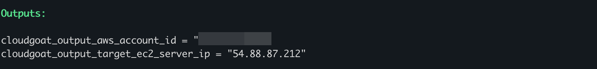
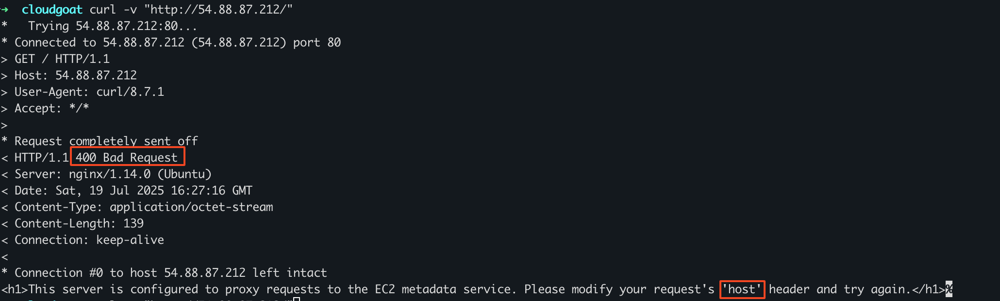
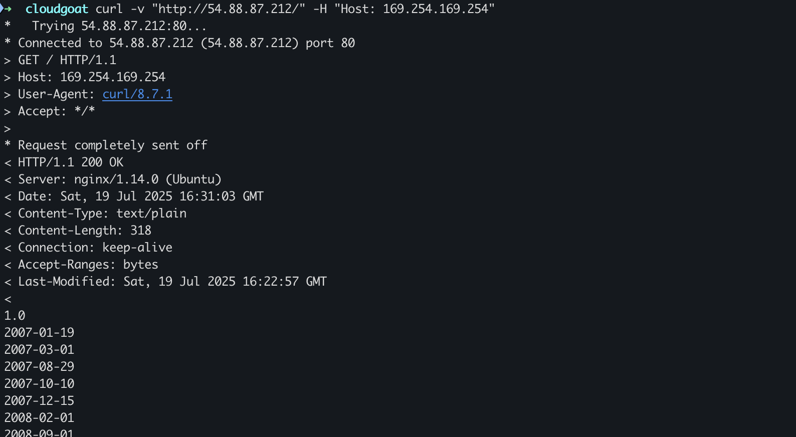
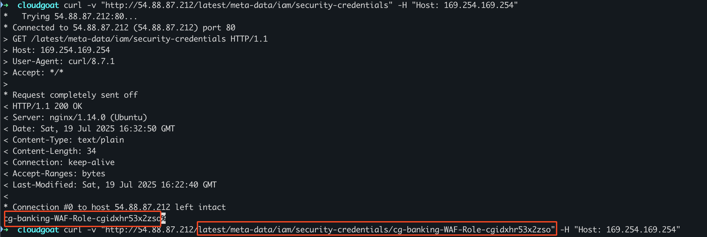
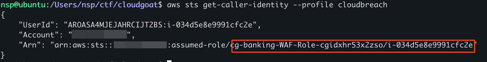
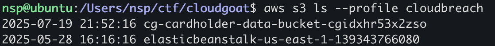
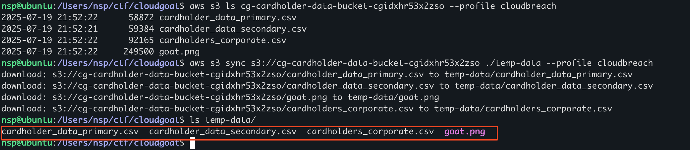

+++
title = 'Hands on Cloud Pentesting: 10 - Cloudgoat cloud_breach_s3'
date = 2025-07-14T20:29:12+05:30
draft = false
series = "Hands on Cloud Pentesting"
tags = ["cloud","aws"]
+++

<!--more-->

## cloud_breach_s3 (Medium)

[Scenario Page](https://github.com/RhinoSecurityLabs/cloudgoat/blob/master/cloudgoat/scenarios/aws/cloud_breach_s3/README.md)
### Description
Starting as an anonymous outsider with no access or privileges, exploit a misconfigured reverse-proxy server to query the EC2 metadata service and acquire instance profile keys. Then, use those keys to discover, access, and exfiltrate sensitive data from an S3 bucket.

### Scenario Goal(s)
Download the confidential files from the S3 bucket.

### Solution
Start the scenario
```bash
cloudgoat create cloud_breach_s3
```

For this scenario, we are only given a targe EC2 ip address.
Sending a curl request to the ip address gives us a 400 error with the following response content.

[EC2 metadata service](https://hackingthe.cloud/aws/exploitation/ec2-metadata-ssrf/) can be abused to retrieve IAM credentials and the server tells us to modify the host header. We can change the host header to the [IMDS](https://hackingthe.cloud/aws/general-knowledge/intro_metadata_service/) ip address, ie 169.254.169.254, and see what response we get.

This is the response usually seen from the internal metadata endpoint which means that the server is acting as a reverse proxy to send our request to the internal metadata service. We can abuse this to retrieve IAM credentials from the path `/latest/meta-data/iam/security-credentials/cg-banking-WAF-Role-cgidxhr53x2zso`

Once we have configured the credentials we can see that we now have the assumed role of `cg-banking-WAF-Role-cgidxhr53x2zso`


Since out goal is to exfiltrate documents from S3, lets enumerate S3 buckets.

There are 2 buckets `cg-cardholder-data-bucket-cgidxhr53x2zso` and `elasticbeanstalk-us-east-1-139343766080`
Enumerating further, we discover sensitive information which we can download, hence achieving the scenario goal.
```bash
aws s3 sync s3://cg-cardholder-data-bucket-cgidxhr53x2zso ./temp-data --profile cloudbreach
```



Stop the scenario
```bash
cloudgoat destroy cloud_breach_s3
```