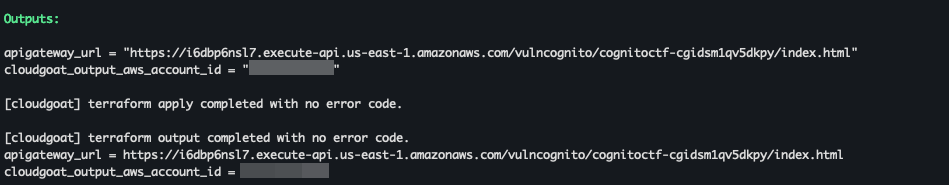
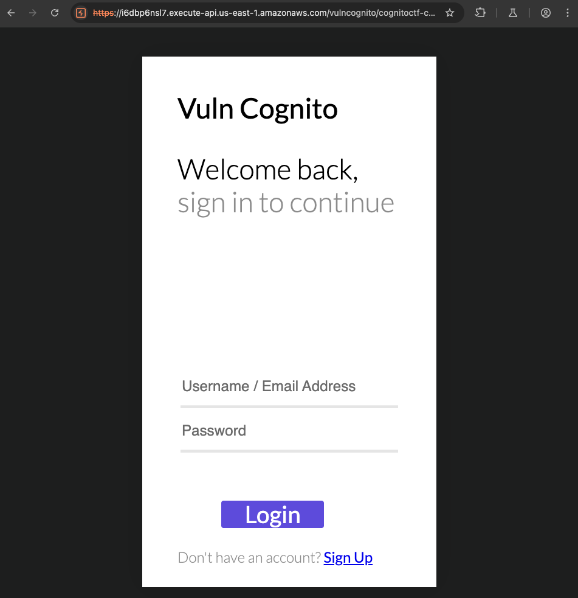
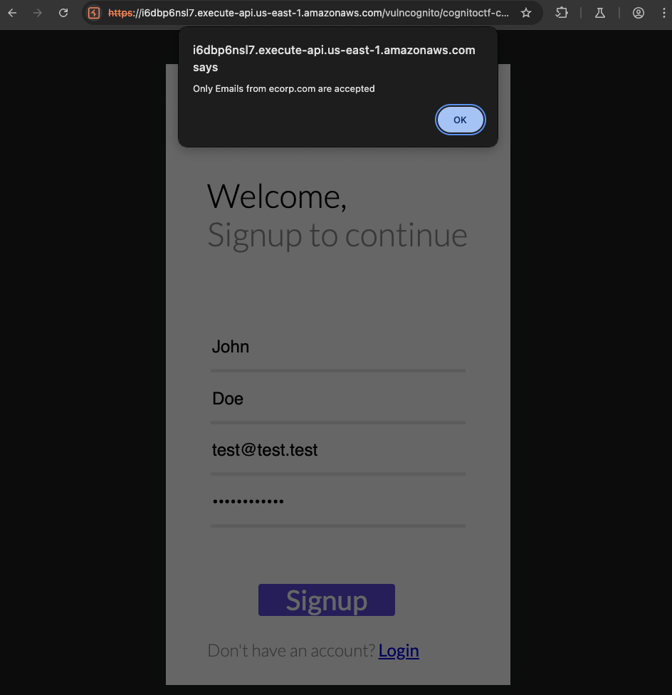
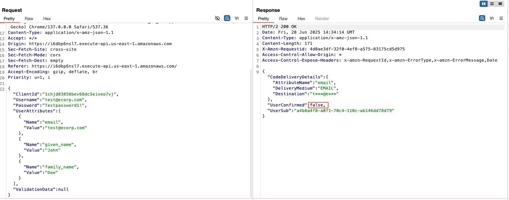
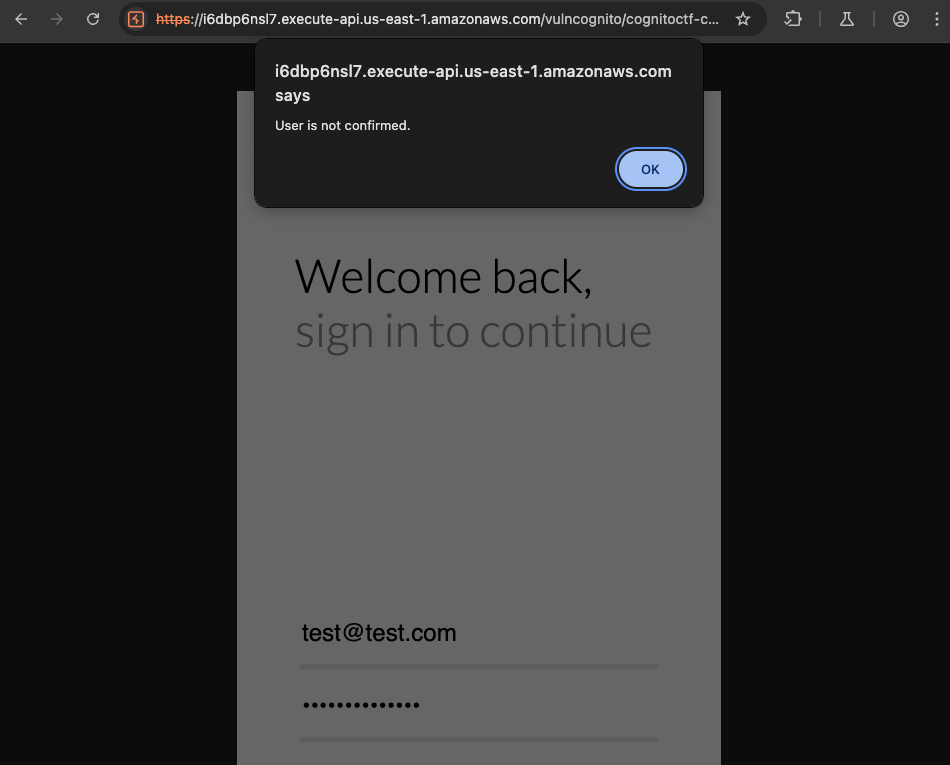
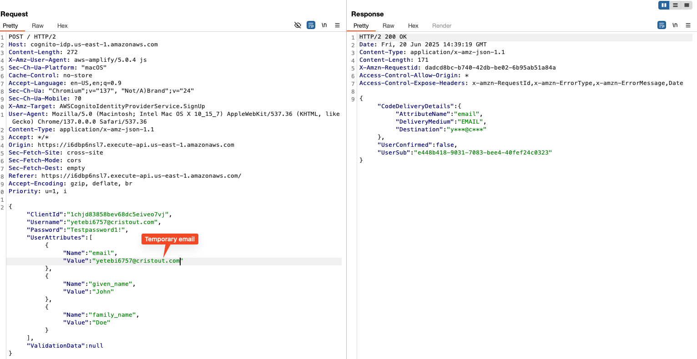
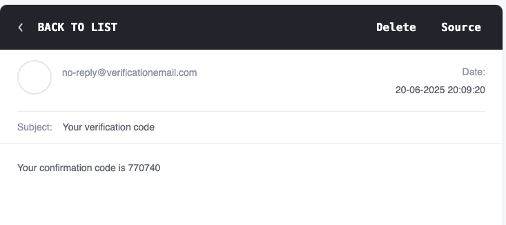
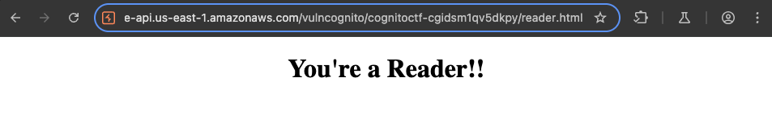
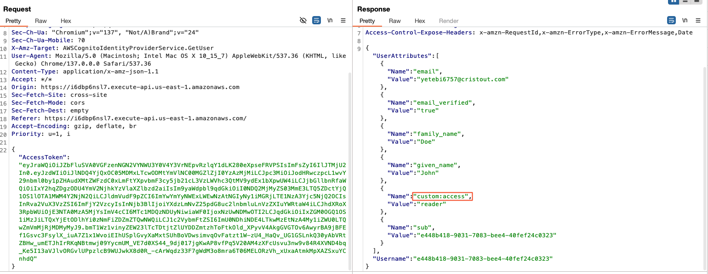

+++
title = 'Hands on Cloud Pentesting: 7 - Cloudgoat vulnerable_cognito'
date = 2025-06-20T12:00:52+05:30
draft = false
series = "Hands on Cloud Pentesting"
tags = ["cloud","aws"]
+++

<!--more-->

## vulnerable_cognito (Medium)

[Scenario Page](https://github.com/RhinoSecurityLabs/cloudgoat/blob/master/cloudgoat/scenarios/aws/vulnerable_cognito/README.md)
### Description
In this scenario, you are presented with a signup and login page with AWS Cognito in the backend. You need to bypass restrictions and exploit misconfigurations in Amazon Cognito in order to elevate your privileges and get Cognito Identity Pool credentials.

### Scenario Goal(s)
Get Cognito IdentityPool credentials.

### Solution
Start the scenario using the following command
```bash
cloudgoat create vulnerable_cognito
```

Once the scenario is deployed, we start off with an API Gateway URL.


The website gives us a login/signup form for "Vuln Cognito".

[Amazon Cognito](https://aws.amazon.com/cognito/) is a user identity and access management service that is offered by AWS that provides user authentication and authorization to mobile or web apps. Unlike AWS IAM which is focused on controlling access to AWS resources, Cognito is focused on user authentication and authorization for web and mobile applications.

We can try to create an account with the sign up option but it seems we are only allowed to use emails from ecorp.com domain.


Upon inspecting the request in BurpSuite, we can see the json data being sent in the request and the response that comes back which includes a field called `UserConfirmed` which is currently false.

If we try to login with the above creds we can see that user confirmation is required


Using burp repeater, we can send the same request with a different email address to see if ecorp.com domain validation is only present on client side.

And sure enough, registration is done and if we check the emaill inbox, we can see a verification code.


The image given below from [aws docs](https://docs.aws.amazon.com/cognito/latest/developerguide/signing-up-users-in-your-app.html) depicts the overview of user account confirmation


[aws cli](https://docs.aws.amazon.com/cli/latest/reference/cognito-idp/confirm-sign-up.html) provides an api for confirming sign up. For this, we need client-id, username and confirmation-code. We can find this in the html source of the page:
```html
...
<script>

function Redirect(){


  
}


function Login(){

  var email = document.getElementById('email').value;
  var password = document.getElementById('password').value;

  var CognitoUserPool = AmazonCognitoIdentity.CognitoUserPool;
  var poolData = {
    UserPoolId: 'us-east-1_rtLumzpQn',
    ClientId: '1chjd83858bev68dc5eiveo7vj',
  };
  var authenticationData = {
    Username: email,
    Password: password,
  };
  var authenticationDetails = new AmazonCognitoIdentity.AuthenticationDetails(
    authenticationData
  );
 
  var userPool = new AmazonCognitoIdentity.CognitoUserPool(poolData);
  var userData = {
    Username: email,
    Pool: userPool,
  };
  var cognitoUser = new AmazonCognitoIdentity.CognitoUser(userData);

//  cognitoUser.setAuthenticationFlowType('USER_PASSWORD_AUTH');

  cognitoUser.authenticateUser(authenticationDetails, {
    onSuccess: function(result) {
      var accessToken = result.getAccessToken().getJwtToken();

        cognitoUser.getUserAttributes(function(err, result) {
        if (err) {
          alert(err.message || JSON.stringify(err));
          return;
        }
        
        var access = result[4].getValue() // currently the 'custom:access' is at index 4
        // or if the index changes again,
        // the following code always gets it
        // for (const name of result) {
        //   if (name.Name === "custom:access") {
        //     access = name.Value;
        //   }
        // }

        console.log(access)

        if(access == 'admin'){
          window.location = "./admin.html";
        }
        else{
          window.location = "./reader.html"
        }

        for (i = 0; i < result.length; i++) {
          console.log(
            'attribute ' + result[i].getName() + ' has value ' + result[i].getValue()
          );

        }
      });
      //Login Redirect here

    },

    onFailure: function(err) {
      alert(err.message || JSON.stringify(err));
    },
  });
}
</script>
...
```

Here we also see another interesting endpoint called `/admin.html` which we are redirected to if we have `access == 'admin'` but lets come back to that later. Using the client id we can try to confirm user account.
```bash
aws cognito-idp confirm-sign-up --client-id 1chjd83858bev68dc5eiveo7vj --username=<temp_email_id> --confirmation-code <confirmation_code> --region us-east-1
```
After this we can login successfully and are redirected to the `/reader.html` page


We can try simply navigating to /admin.html but the page does not give us any useful info. So lets go back to the login flow and see if there's anything else.

One of the requests shows the `UserAttributes` of our user including a custom one called `access` which is currently set to user.


To change the custom attribute to `admin` we can use the [update-user-attributes](https://docs.aws.amazon.com/cli/latest/reference/cognito-idp/update-user-attributes.html) api. For this we need an access token which was generated when we logged in and can be seen in the above request as it was being used to retrieve the user attributes.
```bash
aws cognito-idp update-user-attributes --access-token <access_token> --user-attributes Name="custom:access",Value="admin" --region us-east-1
```
Now if we login again we can see that we are automatically redirected to the `/admin.html` page and our attribute update has succeeded. The admin page uses the identity pool id to obtain AWS credentials which is the Scenario Goal.

Stop the scenario using the following command
```bash
cloudgoat destroy vulnerable_cognito
```